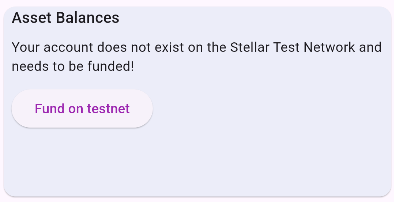
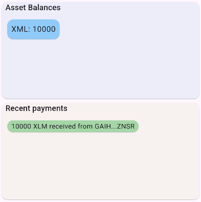

# Account Creation

Accounts are the central data structure in Stellar and can only exist with a valid keypair (a public and secret key) and the required minimum balance of XLM.
Read more in the [Stellar docs: Accounts section](https://developers.stellar.org/docs/learn/fundamentals/stellar-data-structures/accounts).

After signup, the user get's redirected to the dashboard home page.

## Fund account

The [balances overview widget](https://github.com/Soneso/flutter_basic_pay/blob/main/lib/widgets/dashboard/overview/balances_overview.dart) shows that the uses account is not yet funded.



If the user presses the `Fund on testnet` button, we request the Stellar Testnet's `Friendbot` to fund the account by using our [`DashboardData`](https://github.com/Soneso/flutter_basic_pay/blob/main/lib/services/data.dart) instance. See also [dashboard data](dashboard_data.md) and [dashboard state](dashboard_state.md).

```dart
//...

var dashboardState = Provider.of<DashboardState>(context);

//...

onFundAccount: () async => dashboardState.data.fundUserAccount();
```

## Dashboard data

`DashboardData` uses the [`StellarService`](https://github.com/Soneso/flutter_basic_pay/blob/main/lib/services/stellar.dart) to communicate with the Stellar Network. 

```dart

/// Funds the user account on the Stellar Test Network by using Friendbot.
Future<bool> fundUserAccount() async {
    // fund account
    var funded = await StellarService.fundTestNetAccount(userAddress);
    if (!funded) {
        return false;
    }

    // Wait for the ledger to close.
    await Future.delayed(const Duration(seconds: 5));

    // reload assets so that our data is updated.
    await loadAssets();
    await loadRecentPayments();

    return true;
}
```

`StellarService` uses the wallet sdk to fund the testnet account:


```dart
/// Funds the account given by [address] on the Stellar Test Network by using Friendbot.
static Future<bool> fundTestNetAccount(String address) async {
    // fund account
    return await _wallet.stellar().account().fundTestNetAccount(address);
}
```

After using the wallet to fund the account, we wait a bit to make sure that the current ledger on the Testnet has been closed and then  we reload the asset balances and recent payments so that they will be displayed on the dashboard.



When you're ready to move your application to Pubnet, accounts will need to be funded with real XLM. This is something the application can cover itself by depositing XLM into the user's account, with the use of [sponsored reserves](https://developers.stellar.org/docs/learn/encyclopedia/transactions-specialized/sponsored-reserves), or the user can cover the required balance with their own XLM. See also [sponsoring transactions with the wallet sdk](https://developers.stellar.org/docs/building-apps/wallet/stellar#sponsoring-transactions).


## Next

Continue with [Manage trust](manage_trust.md)
