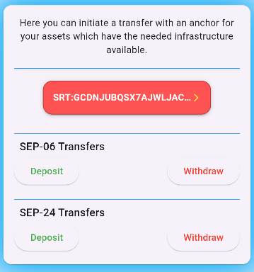

# Anchor Integration

An anchor is a Stellar-specific term for the on and off-ramps that connect the Stellar network to traditional financial rails, such as financial institutions or fintech companies. When a user deposits with an anchor, that anchor will credit their Stellar account with the equivalent amount of digital tokens. The user can then hold, transfer, or trade those tokens just like any other Stellar asset. When a user withdraws those tokens, the anchor redeems them for cash in hand or money in the bank. Read more about anchors in this [Stellar docs anchor section](https://developers.stellar.org/docs/learn/fundamentals/anchors).

When a customer downloads a wallet application that is connected to an anchor service, their Stellar account can either be created by the wallet application or the anchor service. In this example, the account has been created by the wallet application, Flutter Basic Pay. Account creation strategies are described more in-depth [here](https://developers.stellar.org/docs/build/apps/application-design-considerations#account-creation-strategies).

In this example, we’ll use an anchor on Stellar’s Testnet to simulate a bank transfer into and out of the user’s wallet using [SEP-6: Deposit and Withdrawal API](https://github.com/stellar/stellar-protocol/blob/master/ecosystem/sep-0006.md) and/or [SEP-24: Hosted Deposit and Withdrawal](https://github.com/stellar/stellar-protocol/blob/master/ecosystem/sep-0024.md).

Our integrations will also use the following SEPs:

- [SEP-1: Stellar TOML](https://github.com/stellar/stellar-protocol/blob/master/ecosystem/sep-0001.md) - a file that provides a place for the Internet to find information about an organization’s Stellar integration.
- [SEP-9: Standard KYC Fields](https://github.com/stellar/stellar-protocol/blob/master/ecosystem/sep-0009.md) - defines a list of standard KYC fields for use in Stellar ecosystem protocols.
- [SEP-10: Stellar Web Authentication](https://github.com/stellar/stellar-protocol/blob/master/ecosystem/sep-0010.md) - defines the standard way for clients to create authenticated web sessions on behalf of a user who holds a Stellar account.
- [SEP-12: KYC API](https://github.com/stellar/stellar-protocol/blob/master/ecosystem/sep-0012.md) - defines a standard way for Stellar clients to upload KYC information to anchors.

## Finding anchored assets

Flutter Basic Pay takes care of all the anchor transfer details on the Transfers View.

.

It is implemented in [transfers_page.dart](https://github.com/Soneso/flutter_basic_pay/blob/main/lib/widgets/dashboard/transfers/transfers_page.dart)

We need our application to know how it can communicate with anchors to get asset and infrastructure information. The first thing we'll do is determine whether the user holds trustlines to any assets that have a `home_domain` field set on the Stellar network. The presence of that field on an issuer's account tells us the asset *may* be plugged into the existing Stellar rails allowing for transfers of the asset. If it's present, we'll display some interactive elements to the user for that asset/domain.

```dart
static Future<List<AnchoredAssetInfo>> getAnchoredAssets(
      List<AssetInfo> fromAssets) async {

    List<AnchoredAssetInfo> anchorAssets =
        List<AnchoredAssetInfo>.empty(growable: true);
    for (var assetInfo in fromAssets) {
      var asset = assetInfo.asset;

      // We are only interested in issued assets (not XLM)
      if (asset is wallet_sdk.IssuedAssetId &&
          await wallet.stellar().account().accountExists(asset.issuer)) {
        String? anchorDomain;

        // check if it is a known stellar testanchor asset
        // if yes, we can use anchor-sep-server-dev.stellar.org as anchor.
        if (testAnchorAssets.firstWhereOrNull((val) =>
                val.code == asset.code && val.issuer == asset.issuer) !=
            null) {
          anchorDomain = testAnchorDomain;
        } else {
          // otherwise load from home domain (maybe it is an anchor ...)
          var issuerAccountInfo =
              await wallet.stellar().account().getInfo(asset.issuer);
          if (issuerAccountInfo.homeDomain != null) {
            anchorDomain = issuerAccountInfo.homeDomain!;
          }
        }

        if (anchorDomain != null) {
          anchorAssets.add(AnchoredAssetInfo(
              asset: asset,
              balance: assetInfo.balance,
              anchor: wallet.anchor(anchorDomain)));
        }
      }
    }
    return anchorAssets;
  }
```
Source: [stellar.dart](https://github.com/Soneso/flutter_basic_pay/blob/main/lib/services/stellar.dart)

In this demo app, we will use the predefined assets `SRT` and `USDC`, because we know for sure that they are supported by the *Stellar Test Anchor* (see [https://anchor-sep-server-dev.stellar.org/.well-known/stellar.toml](https://anchor-sep-server-dev.stellar.org/.well-known/stellar.toml)). So, please make sure to add a trustline to those assets as described in [Mange Trust](manage_trust.md) before continuing. For all other issued assets from the balances, we are going to use their home domain as an anchor domain.

As soon as the anchored assets are loaded, the Transfers view will display them in a dropdown.


As you can see in the source code above, each created anchored asset object has wallet SDK Anchor object assigned to it `anchor: wallet.anchor(anchorDomain))`. The best anchored asset to be used for our demo, is the `Stellar Reference Token (SRT)` because the Stellar Test Anchor supports SEP-6 and SEP-24 deposits and withdrawals for this asset. Please select the `SRT` asset from the dropdown.

## SEP-1: Stellar TOML

The [stellar.toml file](https://developers.stellar.org/docs/tokens/publishing-asset-info#completing-your-stellartoml) is a common place where the Internet can find information about an organization’s Stellar integration. Regardless of which type of transfer we want to use (SEP-6 or SEP-24), we'll need to start with SEP-1.

For anchors, we’re interested in the `CURRENCIES` they issue, the `TRANSFER_SERVER` and/or `TRANSFER_SERVER_SEP0024` keywords that indicate if the anchor supports SEP-6, SEP-24, or both, and the `WEB_AUTH_ENDPOINT` which allows a wallet to set up an authenticated user session.

For `SRT`, Flutter Basic Pay is interoperating with the testing anchor located at `testanchor.stellar.org` and you can view its toml file [here](https://anchor-sep-server-dev.stellar.org/.well-known/stellar.toml).

The wallet sdk offers support for parsing the anchors toml data. We can access it to see if the anchor provides an authentication service (SEP-10):

```dart
var anchoredAsset = getSelectedAnchorAsset();
String? error;
try {
    TomlInfo tomlInfo = await anchoredAsset.anchor.sep1();
    if (tomlInfo.webAuthEndpoint == null) {
        error = "the anchor does not provide an authentication service (SEP-10)";
    }
} catch (e) {
    if (e is TomlNotFoundException) {
        error = "the anchor does not provide a stellar.toml file";
    } else {
        error = "could not load the asset's anchor toml data. ${e.toString()}";
    }
}
```

Using the `stellar.toml` information for an anchored asset, we can display to the user some options (depending on the available infrastructure). We'll start with SEP-10 authentication.

## SEP-10: Stellar Web Authentication

Similar to the SEP-1 information, both SEP-6 and SEP-24 protocols make use of SEP-10 for authentication with the user. The user must prove they own the account before they can withdraw or deposit any assets as part of [SEP-10: Stellar Web Authentication](https://github.com/stellar/stellar-protocol/blob/master/ecosystem/sep-0010.md).

### Prompt for authentication

The wallet sdk offers support for SEP-10 Web Authentication. The sdk offers multiple ways to authenticate the user with the anchor. In this demo app we are going to simply use the users secret key to authenticate with the anchor. To be able to access the key, we need the user to enter their pin, so that we can load and decod the key from the secure storage entry (see [secure data storage](./secure_data_storage.md)).


### Authenticate with the anchor

As soon as the user enters their pin, we can authenticate the user with the anchor:

```dart
try {
    // load and decode the secret key by using the users pin
    var userKeyPair = await dashboardState.authService.userKeyPair(pin);

    // authenticate with anchor
    var sep10 = await anchoredAsset.anchor.sep10();
    _sep10AuthToken = await sep10.authenticate(userKeyPair);

} catch (e) {
    
    var error = "could not authenticate with the asset's anchor.";

    if (e is InvalidPin) {
        error = "invalid pin";
    } else if (e is AnchorAuthException) {
        error += ' ${e.message}';
    } else if (e is AnchorAuthNotSupported) {
        error = "the anchor does not provide an authentication service (SEP-10)";
    }
    
    // ...
}
```

The wallet sdk makes it easy to authenticate with the anchor. It abstracts the stellar specific functionality, so that we can just call `_sep10AuthToken = await sep10.authenticate(userKeyPair);` to get the authentication token containing the jwt that we will need for further steps.

## SEP-6: Deposit and Withdrawal API

[SEP-6](https://github.com/stellar/stellar-protocol/blob/master/ecosystem/sep-0006.md) allows wallets and other clients to interact with anchors directly without the user needing to leave the wallet to go to the anchor’s site. In this integration, a user’s KYC information is gathered and handled by the wallet and submitted to the anchor on behalf of the user.

Before we can ask anything about how to make a SEP-6 transfer, we have to figure out where to discover that information. Fortunately, the SEP-1 protocol describes standardized fields to find out what we need.

### SEP-6 Support

```dart
bool sep6Supported = false;
TomlInfo tomlInfo = await anchoredAsset.anchor.sep1();
if (tomlInfo.transferServer != null) {
    sep6Supported = true;
}
```

### Get info

Now that we know that SEP-06 is supported, Flutter Basic Pay needs to fetch the /info endpoint from the anchor's transfer server to understand the supported transfer methods (deposit, withdraw, deposit-exchange, and withdraw-exchange) and available endpoints, as well as additional features that may be available during transfers.

We can load the needed info by using the wallet sdk:

```dart
var sep6 = anchoredAsset.anchor.sep6();
_sep6Info = await sep6.info();
```

### Display interactive elements

Depending on which transfer methods the anchor offers for our asset, we can now display the corresponding buttons (in Flutter Basic Pay, only deposits and withdraws are supported, future version will also incorporate the *-exchange transfer methods.)

To find out whether deposit is supported for our asset, we can check the `Sep6Info` object we received earlier from the sdk:

```dart
Sep6DepositInfo? getDepositInfoIfEnabled(Sep6Info sep6Info, String assetCode) {
    if (sep6Info.deposit != null && sep6Info.deposit!.containsKey(assetCode)) {
        var depositInfo = sep6Info.deposit![assetCode]!;
        if (depositInfo.enabled) {
            return depositInfo;
        }
    }
    return null;
}
```
Source: [sep6_new_transfer_widget.dart](https://github.com/Soneso/flutter_basic_pay/blob/main/lib/widgets/dashboard/transfers/sep6_new_transfer_widget.dart)

If supported, we now have a `Sep6DepositInfo` sdk object that we can use if the user wants to initiate a deposit.

To find out whether withdrawal is supported for our asset, we can also check the `Sep6Info` object we received earlier from the sdk:

```dart
Sep6WithdrawInfo? getWithdrawalInfoIfEnabled(Sep6Info sep6Info, String assetCode) {
    if (sep6Info.withdraw != null && sep6Info.withdraw!.containsKey(assetCode)) {
        var withdrawInfo = sep6Info.withdraw![assetCode]!;
        if (withdrawInfo.enabled) {
            return withdrawInfo;
        }
    }
    return null;
}
```
Source: [sep6_new_transfer_widget.dart](https://github.com/Soneso/flutter_basic_pay/blob/main/lib/widgets/dashboard/transfers/sep6_new_transfer_widget.dart)

If supported, we now have a `Sep6WithdrawInfo` sdk object that we can use if the user wants to initiate a withdrawal.

Depending on which methods are supported, we can now display the corresponding buttons.


### Deposit

If the user presses the deposit button, Flutter Basic Pay displays a view called `Sep6DepositStepper`. It is used to collect the needed data to initiate a new SEP-06 deposit transfer.


The `Sep6DepositStepper` is initialized as follows:

```dart
bool anchorHasEnabledFeeEndpoint = sep6Info.fee != null && sep6Info.fee!.enabled;
// ...

return Sep6DepositStepper(
        anchoredAsset: anchoredAsset,
        depositInfo: _depositInfo!,
        anchorHasEnabledFeeEndpoint: anchorHasEnabledFeeEndpoint,
        authToken: authToken);
```

Source: [sep6_new_transfer_widget.dart](https://github.com/Soneso/flutter_basic_pay/blob/main/lib/widgets/dashboard/transfers/sep6_new_transfer_widget.dart)

As parameters, it receives the anchored asset that was selected, the `Sep6DepositInfo` object that we previously received from the sdk, the information whether the anchor provides an enabled fee endpoint and the SEP-10 auth token. 

Once launched, the `Sep6DepositStepper` will walk the user through a "wizard" to gather all the required information and ultimately create the transfer. Source: [sep6_deposit_stepper.dart](https://github.com/Soneso/flutter_basic_pay/blob/main/lib/widgets/dashboard/transfers/sep6_deposit_stepper.dart).

#### Step 1: Transfer details

Flutter Basic Pay prompts the user to input the transfer fields required by the anchor (from `depositInfo.fieldsInfo`) and the amount.


#### Step 2: Gather KYC information

Next, our `Sep6DepositStepper` queries the anchor’s [SEP-12](https://github.com/stellar/stellar-protocol/blob/master/ecosystem/sep-0012.md) endpoint for the required KYC fields by using the wallet sdk, and we present these fields for the user to complete.

```dart
var sep12 = await anchoredAsset.anchor.sep12(authToken);
_sep12Info = await sep12.getByAuthTokenOnly();
```

Source: [sep6_deposit_stepper.dart](https://github.com/Soneso/flutter_basic_pay/blob/main/lib/widgets/dashboard/transfers/sep6_deposit_stepper.dart).

Depending on the received status from the Server we can show it to the user or request KYC information if needed:

```dart
var sep12Info = _sep12Info!;
var status = sep12Info.sep12Status;
if (status == Sep12Status.accepted) {
    return Column(
        crossAxisAlignment: CrossAxisAlignment.start,
        children: <Widget>[
            text(context, 'Your KYC data has been accepted by the anchor.'),
            const SizedBox(height: 10),
            ElevatedButton(
                onPressed: deleteAnchorKycData, child: const Text('Delete')),
        ],
    );
} else if (status == Sep12Status.processing) {
    return Column(
        crossAxisAlignment: CrossAxisAlignment.start,
        children: <Widget>[
            text(context,
                'Your KYC data is currently being processed by the anchor.'),
        ],
    );
} else if (status == Sep12Status.rejected) {
    return Column(
        crossAxisAlignment: CrossAxisAlignment.start,
        children: <Widget>[
            text(context, 'Your KYC data has been rejected by the anchor.'),
        ],
    );
} else if (status == Sep12Status.needsInfo) {
    return Column(
        crossAxisAlignment: CrossAxisAlignment.start,
        children: <Widget>[
            text(context, 'The Anchor needs following of your KYC data:'),
            getKycCollectorForm(),
        ],
    );
} else {
    return Column(
        crossAxisAlignment: CrossAxisAlignment.start,
        children: <Widget>[
            text(context, 'Your KYC data status is unknown.'),
        ],
    );
}
```

If the user has not transmitted the KYC data before, the SEP-12 status will be `Sep12Status.needsInfo` and the `sep12Info` object will contain the required fields that need to be filled by the user:


As soon as the user provided the necessary information for the KYC requirements of the anchor and presses the `Next` button, we can submit the provided KYC information to the anchor's KYC server.

```dart
var sep12 = await anchoredAsset.anchor.sep12(authToken);
var customerId = _sep12Info?.id;
var kycForm = getKycCollectorForm();
if (customerId == null) {
    // new anchor customer
    await sep12.add(kycForm.collectedFields);
} else {
    // known anchor customer
    await sep12.update(kycForm.collectedFields, customerId);
}

// ...
await Future.delayed(const Duration(seconds: 5));
await loadKycData();
```

After sending the KYC data, we wait a couple of seconds for the server to do it's job and then reload the info.
The status has changed and in our case, it is now `Sep12Status.accepted` so that we can show that to the user:


#### Step 3: Fee calculation

In this Step we try to calculate the fee that the anchor will apply for the transfer:

```dart
Future<void> loadFee(Map<String, String?> transferDetails) async {
    double? feeFixed = widget.depositInfo.feeFixed;
    double? feePercent = widget.depositInfo.feePercent;

    if (feeFixed != null) {
        _fee = feeFixed;
        return;
    }

    if (feePercent != null && _amount != null) {
        _fee = _amount! * feePercent / 100;
        return;
    }

    if (widget.anchorHasEnabledFeeEndpoint && _amount != null) {
        String? type;
        if (transferDetails.containsKey('type')) {
            type = transferDetails['type'];
        }
        try {
            _fee = await widget.anchoredAsset.anchor.sep6().fee(
                    operation: 'deposit',
                    assetCode: getAssetCode(),
                    type: type,
                    amount: _amount!,
                    authToken: widget.authToken,
                );
        } catch (e) {
            _fee = null;
        }
    }
}
```

Source: [sep6_deposit_stepper.dart](https://github.com/Soneso/flutter_basic_pay/blob/main/lib/widgets/dashboard/transfers/sep6_deposit_stepper.dart).

If deposit info that we received earlier by using the sdk contains a fixed fee info or a fee percent info, then we can apply that. Otherwise, if the anchor provides a `fee` endpoint, we can use it to determine the fee.

If we were able to determine the fee, we can now show it to the user:


#### Step 4: Submit transfer

Flutter Basic Pay makes this request by taking all the fields that have been collected during this process and using the wallet sdk:

```dart
var destinationAsset = anchoredAsset.asset;
var sep06 = anchoredAsset.anchor.sep6();

Map<String, String> extraFields = {};

var transferDetailsForm = getTransferDetailsForm();
for (var entry in transferDetailsForm.collectedFields.entries) {
    if (entry.key != TransferDetailsForm.transferAmountKey &&
        entry.value != null) {
        extraFields[entry.key] = entry.value!;
    }
}

var sep6DepositParams = Sep6DepositParams(
    assetCode: destinationAsset.code,
    account: authToken.account,
    amount: _amount!.toString(),
    extraFields: extraFields
);

_submissionResult = await sep06.deposit(sep6DepositParams, authToken);
```

Then we display the transfer server's response to the user.


As soon as the Stellar Test Anchor sends the funds, we can see it in the overview:


### Withdrawal

The withdrawal process is similar to the deposit process and can be found in [sep6_withdraw_stepper.dart](https://github.com/Soneso/flutter_basic_pay/blob/main/lib/widgets/dashboard/transfers/sep6_withdraw_stepper.dart)


## SEP-24: Hosted Deposit and Withdrawal

[SEP-24](https://github.com/stellar/stellar-protocol/blob/master/ecosystem/sep-0024.md) provides a standard way for wallets and anchors to interact by having the user open a webview hosted by an anchor to collect and handle KYC information. In this integration, a user's KYC information is gathered and handled entirely by the anchor. For the most part, after the anchor's webview has opened, Flutter Basic Pay will have little knowledge about what's going on.

Before we can ask anything about how to make a SEP-24 transfer, we have to figure out where to discover that information. Fortunately, the SEP-1 protocol describes standardized fields to find out what we need.

### SEP-24 Support

```dart
bool sep24Supported = false;
TomlInfo tomlInfo = await anchoredAsset.anchor.sep1();
if (tomlInfo.transferServerSep24 != null) {
    sep24Supported = true;
}
```

Source [transfers_page.dart](https://github.com/Soneso/flutter_basic_pay/blob/main/lib/widgets/dashboard/transfers/transfers_page.dart)

### Get info

Now that we know that SEP-24 is supported, Flutter Basic Pay needs to fetch the /info endpoint from the anchor to understand the supported transfer methods (deposit, withdraw) and available endpoints, as well as additional features that may be available during transfers.

We can load the needed info by using the wallet sdk:

```dart
var sep24 = anchoredAsset.anchor.sep24();
_sep24Info = await sep24.getServiceInfo();
```

### Display interactive elements

Depending on which transfer methods the anchor offers for our asset, we can now display the corresponding buttons.

To find out whether deposit is supported for our asset, we can check the `AnchorServiceInfo` (`_sep24Info`) object we received earlier from the sdk:

```dart
AnchorServiceAsset? getDepositInfoIfEnabled(AnchorServiceInfo sep24Info, String assetCode) {
    if (sep24Info.deposit.containsKey(assetCode)) {
        var depositInfo = sep24Info.deposit[assetCode]!;
        if (depositInfo.enabled) {
            return depositInfo;
        }
    }
    return null;
}
```

Source: [sep24_new_transfer_widget.dart](https://github.com/Soneso/flutter_basic_pay/blob/main/lib/widgets/dashboard/transfers/sep24_new_transfer_widget.dart)

If supported, we now have a `AnchorServiceAsset` sdk object that we can use if the user wants to initiate a deposit.

To find out whether withdrawal is supported for our asset, we can also check the `AnchorServiceInfo` (`_sep24Info`) object we received earlier from the sdk:

```dart
AnchorServiceAsset? getWithdrawalInfoIfEnabled(AnchorServiceInfo sep24Info, String assetCode) {
    if (sep24Info.withdraw.containsKey(assetCode)) {
        var withdrawInfo = sep24Info.withdraw[assetCode]!;
        if (withdrawInfo.enabled) {
            return withdrawInfo;
        }
    }
    return null;
}
```

Source: [sep24_new_transfer_widget.dart](https://github.com/Soneso/flutter_basic_pay/blob/main/lib/widgets/dashboard/transfers/sep24_new_transfer_widget.dart)

If supported, we now have a `AnchorServiceAsset` sdk object that we can use if the user wants to initiate a withdrawal.

Depending on which methods are supported, we can now display the corresponding buttons.




### The user clicks "Deposit" or "Withdraw"

Now that we have all the SEP-24 information the anchor has made available to us, it's up to the user to actually begin the initiation process. In Flutter Basic Pay, they do that by simply clicking a button. Flutter Basic Pay then initiates a transfer method by requesting either the “SEP-24 Deposit” or “SEP-24 Withdraw” using the wallet sdk. 

For example deposit:

```dart
var sep24 = anchoredAsset.anchor.sep24();
var interactiveResponse = await sep24.deposit(anchoredAsset.asset, authToken);
var url = interactiveResponse.url;
_controller.loadRequest(Uri.parse(url));
```
Source: [sep24_new_transfer_widget.dart](https://github.com/Soneso/flutter_basic_pay/blob/main/lib/widgets/dashboard/transfers/sep24_new_transfer_widget.dart)

The anchor then returns an interactive URL that Flutter Basic Pay will open as a popup for the user to complete and confirm the transfer.


Flutter Basic Pay doesn't know everything that's happening between the user and the anchor during a SEP-24 transfer. However, in a real app, you may want to know when the interaction is over, since you may need to take some action at that point (e.g. let the user send a stellar payment in case of withdrawal). To do so, you can add a callback to the interactive URL as described in this [section of the SEP-24 specification](https://www.stellar.org/protocol/sep-24#adding-parameters-to-the-url).

### History

With Flutter Basic Pay you can also see how to fetch the transfers history using the wallet sdk. You can find the source code in [transfers_page.dart](https://github.com/Soneso/flutter_basic_pay/blob/main/lib/widgets/dashboard/transfers/transfers_page.dart)

The transfers view offers a toggled button on the upper right, where you can switch to History mode:


After the user selects the anchored asset, the SEP-10 authentication process is started (same as above for new transfers). After receiving the SEP-10 auth token, one can request the transfer history using the wallet sdk:

**SEP-06:**

```dart
var sep6 = anchoredAsset.anchor.sep6();
_sep6HistoryTransactions = await sep6.getTransactionsForAsset(
    authToken: _sep10AuthToken!, assetCode: anchoredAsset.asset.code);
```

**SEP-24:**

```dart
var sep24 = anchoredAsset.anchor.sep24();
_sep24HistoryTransactions = await sep24.getTransactionsForAsset(
    anchoredAsset.asset, _sep10AuthToken!);
```

After loading the transactions, Flutter Basic pay displays them using [sep6_transfer_history.dart](https://github.com/Soneso/flutter_basic_pay/blob/main/lib/widgets/dashboard/transfers/sep6_transfer_history.dart) for SEP-06 transactions and [sep24_transfer_history](https://github.com/Soneso/flutter_basic_pay/blob/main/lib/widgets/dashboard/transfers/sep24_transfer_history.dart) for SEP-24 transactions.


