# Manage trust

For an account to hold and trade assets other than XLM, it must establish a [trustline](https://developers.stellar.org/docs/learn/fundamentals/stellar-data-structures/accounts#trustlines) with the issuing account of that particular asset. Each trustline increases the account’s [base reserve](https://developers.stellar.org/docs/learn/fundamentals/stellar-data-structures/accounts#base-reserves-and-subentries) by 0.5 XLM, which means the account will have to hold more XLM in its minimum balance.

## Adding an asset

First, we’ll have the user create a trustline for an asset by navigating to the Assets page. 

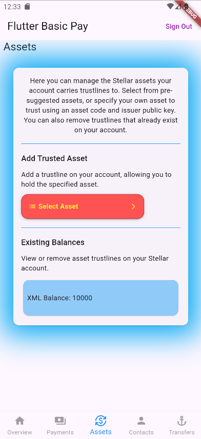

Then select an asset from the dropdown. The dropdown includes two predefined assets. 
This are assets provided by the Stellar Test Anchor. Additionally, one can select "Add custom asset" to insert the asset data.


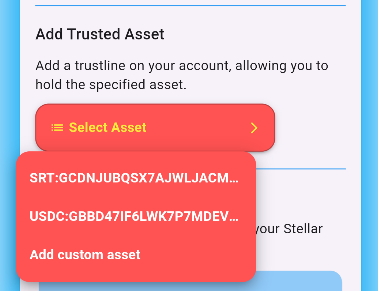

For now, let's select the predefined asset `SRT`. As soon as selected, the page shows the pincode input field:

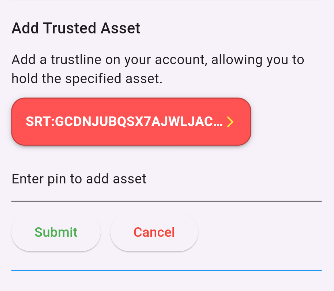

The user must enter their pincode, so that we can request and decrypt their secred key from the secure storage.
We will need it to sign the transaction. After entering the pincode and pressing the `Submit` button, the app builds the transaction and sends it to the Stellar Network.

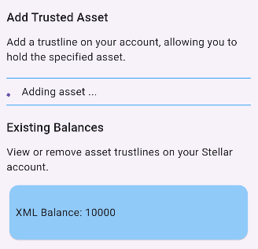

As soon as the trustline has been established, the asset appears in list of existing balances:

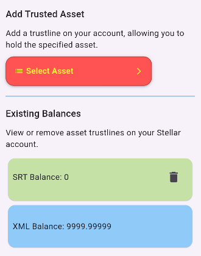

The user's account now trusts the `SRT` asset, can hold it and trade it. We can also see that the `XLM` balance has been reduced. This is because 
all Stellar transactions require a small fee to make it to the ledger. Read more in the Stellar docs [Fees section](https://developers.stellar.org/docs/learn/fundamentals/fees-resource-limits-metering).

If we switch back to the overview page, we can also see that the Asset Balances now include the new trusted asset:

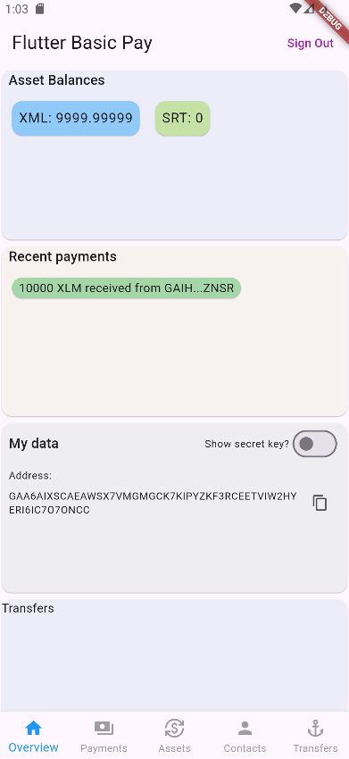

### Code implementation

Now let's have a look how this flow has been implemented. You can find the source code in [assets_page.dart](https://github.com/Soneso/flutter_basic_pay/blob/main/lib/widgets/dashboard/assets/assets_page.dart)

First, we load the assets that the user already trusts, because we do not want to add them to the dropdown and also want to display them in the `Existing Balances` section of our Assets page.

```dart
class AssetsPage extends StatelessWidget {
  const AssetsPage({super.key});

  @override
  Widget build(BuildContext context) {
    var dashboardState = Provider.of<DashboardState>(context);
    return FutureBuilder<List<AssetInfo>>(
      future: dashboardState.data.loadAssets(),
      builder: (context, futureSnapshot) {
        if (!futureSnapshot.hasData) {
          return const Center(
            child: CircularProgressIndicator(),
          );
        }
        return StreamBuilder<List<AssetInfo>>(
          initialData: futureSnapshot.data,
          stream: dashboardState.data.subscribeForAssetsInfo(),
          builder: (context, snapshot) {
            if (snapshot.data == null) {
              return const Center(
                child: CircularProgressIndicator(),
              );
            }
            return AssetsPageBody(
              key: ObjectKey(snapshot.data!),
            );
          },
        );
      },
    );
  }
}
```

During the loading, the app displays a circular progress indicator. As soon as the data is loaded, we return a `StreamBuilder` that is subscribed to updates on the asset data. If the data changes, for example because we added a new trustline, the new data will displayed. 

Let's first have a look, how the data is loaded from the Stellar Network in our [`DashboardData`](https://github.com/Soneso/flutter_basic_pay/blob/main/lib/services/data.dart) instance.

```dart
    /// Loads the users assets from the Stellar Network
Future<List<AssetInfo>> loadAssets() async {
    assets = await StellarService.loadAssetsForAddress(userAddress);
    _emitAssetsInfo();
    return assets;
}   
```

In [`StellarService`](https://github.com/Soneso/flutter_basic_pay/blob/main/lib/services/stellar.dart):

```dart
/// Loads the assets for a given account specified by [address] from the
/// Stellar Network by using the wallet sdk.
static Future<List<AssetInfo>> loadAssetsForAddress(String address) async {
    var loadedAssets = List<AssetInfo>.empty(growable: true);
    try {
        var stellarAccountInfo =
        await _wallet.stellar().account().getInfo(address);
        for (var balance in stellarAccountInfo.balances) {
            loadedAssets.add(AssetInfo(
                asset: wallet_sdk.StellarAssetId.fromAsset(balance.asset),
                balance: balance.balance,
            ));
        }
    } on wallet_sdk.ValidationException {
        // account does not exist
        loadedAssets = List<AssetInfo>.empty(growable: true);
    }
    return loadedAssets;
}
```

We are using the wallet sdk to load the account info for our user, because it contains the balances of all trusted assets.
For each balance we create a new `AssetInfo` object and add it to our list:

```dart
class AssetInfo {
  wallet_sdk.StellarAssetId asset;
  String balance;

  AssetInfo({required this.asset, required this.balance});
}
```
Next we cache the loaded assets in our `DashboardData` member variable `assets` and emit an event to let all subscribed listeners know that the data has been updated.

```dart
/// Emit updates on the list of assets the user holds.
/// E.g. asset added, balance changed.
void _emitAssetsInfo() {
    _assetsInfoStreamController.add(assets);
}
```

See also [dashboard data](dashboard_data.md) and [dashboard state](dashboard_state.md).

Now let's go back to our [assets_page.dart](https://github.com/Soneso/flutter_basic_pay/blob/main/lib/widgets/dashboard/assets/assets_page.dart).

As soon as the data has been loaded, the `AssetsPageBody` widget is displayed instead of the loading indicator.

```dart
return AssetsPageBody(
    key: ObjectKey(snapshot.data!),
);
```

The `AssetsPageBody` widget first checks if the assets list is filled. It must contain at least the native asset (XLM). If not, the assets could not be loaded because the user account does not yet exists on the Stellar Network. In this case the widget informs the user and gives them the possibility to 
fund their account on the Stellar Test Network by using Friendbot.

```dart
child: dashboardState.data.assets.isEmpty
    ? Column(
        crossAxisAlignment: CrossAxisAlignment.start,
        children: [
        Text(
            "Your account does not exist on the Stellar Test Network and needs to be funded!",
            style: Theme.of(context).textTheme.bodyMedium),
        const SizedBox(height: 10),
        ElevatedButton(
            onPressed: () async {
            if (waitForAccountFunding) {
                return;
            }
            setState(() {
                waitForAccountFunding = true;
            });
            dashboardState.data.fundUserAccount();
            },
            child: waitForAccountFunding
                ? const SizedBox(
                    height: 15,
                    width: 15,
                    child: CircularProgressIndicator(),
                )
                : const Text('Fund on testnet',
                    style: TextStyle(color: Colors.purple)),
        ),
        ],
    )
    : const AssetsPageBodyContent()),
```

You can read more about how the funding of the account works in the [Account creation](account_creation.md) section of this tutorial.
As soon as the account is funded, our `DashboardData` instance will load again the asset and emit the corresponding event causing the 
`AssetsPage` widget to rebuild the `AssetsBody` widget. Now we have a non empty list of assets and can display our `AssetsPageBodyContent` widget.

First, we need to fill our dropdown. 

```dart
var dashboardState = Provider.of<DashboardState>(context);

// prepare assets to select from
List<String> dropdownItems = dashboardState.data.knownAssets
    .map((asset) => asset.id)
    .toList(growable: true);

// check if any of the assets are already trusted and if so, remove
List<String> trustedAssets =
    dashboardState.data.assets.map((asset) => asset.asset.id).toList();
dropdownItems.removeWhere((element) => trustedAssets.contains(element));

// add custom item
dropdownItems.add(addCustomAsset);
```

We initialize our list with the two predefined (known) assets of the Stellar Test Anchor: `SRT` and `USDC`. 
Then, we check if any of them is already trusted. If trusted, we remove it from the list because we must not trust it again.
At the end, we add also the `Add custom asset` dropdown item.

Our dropdown is ready:


If the user selects an asset from the dropdown, the [`PinForm`](https://github.com/Soneso/flutter_basic_pay/blob/main/lib/widgets/common/pin_form.dart)
is displayed, so that we can ask the user to enter their pincode:


The `PinForm` widget validates the input format and if valid, it calls the `onPinSet` callback with the inserted pin:

```dart
TextFormField(
    decoration: InputDecoration(
        hintText: widget.hintText,
        hintStyle: Theme.of(context).textTheme.bodyMedium,
    ),
    keyboardType: TextInputType.number,
    inputFormatters: <TextInputFormatter>[
        FilteringTextInputFormatter.digitsOnly,
        LengthLimitingTextInputFormatter(6),
    ],
    obscureText: true,
    validator: (String? value) {
        if (value == null || value.isEmpty || value.length != 6) {
        return 'Please enter 6 digits';
        }
        return null;
    },
    controller: pinTextController,
),

//...

ElevatedButton(
    onPressed: () async {
        // Validate will return true if the form is valid, or false if
        // the form is invalid.
        if (_formKey.currentState!.validate()) {
            widget.onPinSet(pinTextController.text);
        }
    },
    child: const Text(
        'Submit',
        style: TextStyle(color: Colors.green),
    ),
),
```

Now let's go back to our [`AssetsPageBodyContent`](https://github.com/Soneso/flutter_basic_pay/blob/main/lib/widgets/dashboard/assets/assets_page.dart) widget and see what happens on pin set:

```dart
Future<void> _handlePinSet(String pin, DashboardState dashboardState) async {
//...

// compose the asset
wallet_sdk.IssuedAssetId? asset;
if (_selectedAsset == addCustomAsset && _customAsset != null) {
    asset = _customAsset;
} else {
    asset = dashboardState.data.knownAssets
        .firstWhere((item) => item.id == _selectedAsset);
}
if (asset != null) {
    // check if the issuer account id exists on the stellar network
    var issuerExists =
        await dashboardState.data.accountExists(asset.issuer);
    if (!issuerExists) {
        throw IssuerNotFound();
    }

    // load secret seed and check if pin is valid.
    var userKeyPair = await dashboardState.auth.userKeyPair(pin);

    // add trustline
    var added =
        await dashboardState.data.addAssetSupport(asset, userKeyPair);
    if (!added) {
        throw AssetNotAdded();
    }
}

//...
```

After creating the `asset` object of type `wallet_sdk.IssuedAssetId` we first check if the issuer account of the asset exists on the Stellar Network.
This is important because we can only trust assets that are issued by an account that is funded on the Stellar Network.

Next, we request the user keypair from the [auth service](authentication.md). It will provide us the secret key that we will need for signing the transaction.

```dart
// load secret seed and check if pin is valid.
var userKeyPair = await dashboardState.auth.userKeyPair(pin);
```

As you can see, we need to pass the pincode so that the secret key can be decrypted after loading it from [secure storage](secure_data_storage.md).

If the pin is invalid, an exception will be thrown by `dashboardState.auth.userKeyPair(pin)` that we can display to the user. Otherwise we will have the
users keypair and can use it later to sign the transaction.

Next, let's add the trustline:

```dart
var added = await dashboardState.data.addAssetSupport(asset, userKeyPair);
```

In our [`DashboardData`](https://github.com/Soneso/flutter_basic_pay/blob/main/lib/services/data.dart) class we can find the `addAssetSupport` function:

```dart
/// Adds a trust line by using the wallet sdk, so that the user can hold the
/// given [asset]. Requires the user's signing [userKeyPair] to
/// sign the transaction before sending it to the Stellar Network.
/// Returns true on success.
Future<bool> addAssetSupport(wallet_sdk.IssuedAssetId asset,
    wallet_sdk.SigningKeyPair userKeyPair) async {

    var success = await StellarService.addAssetSupport(asset, userKeyPair);

    // Wait for the ledger to close.
    await Future.delayed(const Duration(seconds: 5));

    // reload assets so that our data is updated.
    await loadAssets();

    return success;
}
```

In [`StellarService`](https://github.com/Soneso/flutter_basic_pay/blob/main/lib/services/stellar.dart):

```dart
/// Adds a trust line by using the wallet sdk, so that the user can hold the
/// given [asset]. Requires the user's signing [userKeyPair] to
/// sign the transaction before sending it to the Stellar Network.
/// Returns true on success.
static Future<bool> addAssetSupport(wallet_sdk.IssuedAssetId asset,
    wallet_sdk.SigningKeyPair userKeyPair) async {

    // build sign and submit transaction to stellar.
    var stellar = _wallet.stellar();
    var txBuilder = await stellar.transaction(userKeyPair);
    var tx = txBuilder.addAssetSupport(asset).build();
    stellar.sign(tx, userKeyPair);

    return await stellar.submitTransaction(tx);

}
```

The wallet sdk is used to compose, sign and submit the signed transaction to the Stellar Network. 

After submitting, in `DashboardData` we wait a couple of seconds for the ledger to close and then load the user assets again. `loadAssets()` will repopulate the assets cache and inform all listeners about the update.

As soon as our `StreamBuilder` from the `AssetsPage` widget receives the new list of trusted assets it can rebuild the UI and display the new asset in the
List of existing balances:


## Adding a custom asset

We can use [Stellar Lab](https://laboratory.stellar.org/#?network=test) to create a new issuer account on the Stellar Test Network first. The new issuer will emit our custom asset for this tutorial. 

Navigate to [Stellar Lab](https://laboratory.stellar.org/#?network=test) in your browser:

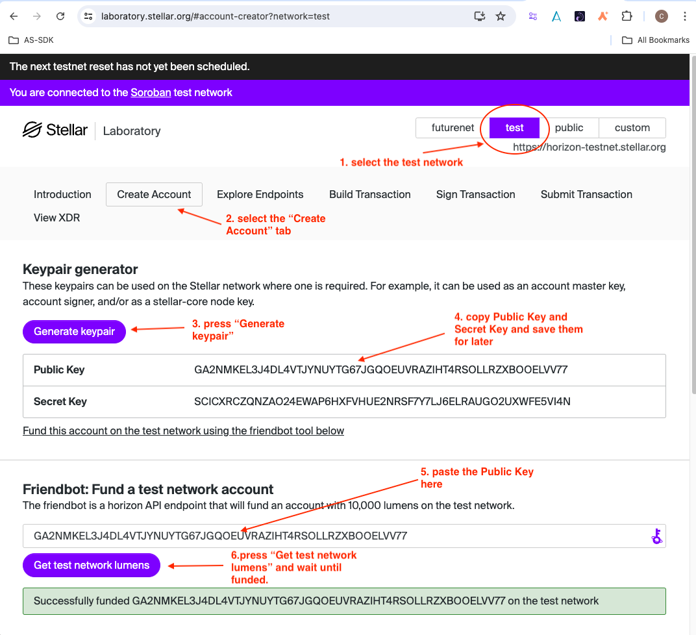

1. Select the `test` Network
2. Select the `Create Account` tab
3. Press the `Generate keypair` button
4. Copy the displayed Public and Secret Key values and save them for later.
5. Paste the Public Key value into Friendbot input field.
6. Press the `Get test network lumens` button and wait until the account is funded.


Now we have a new funded account, that is our `issuer account`. In this case the `account id` (also called `address` or `public key`) is

`GA4W4USE4ZXA5TN2AS6C2CLFYWIWGMV6HTSWRW2S7T5RTTMVDEX5UBEY`

and the `secret key` (also called `secret seed`) is:

`SDEWYN3KNWJTTQMW5ALFDOL37VXWV3DHV64MT6H44KCM5XOBIZS35NDW`

Now that we have an issuer account for testing, let's add a trustline to a custom asset issued by this account using our app. To do so,
we select `Add custom asset` from the assets dropdown on the assets page:

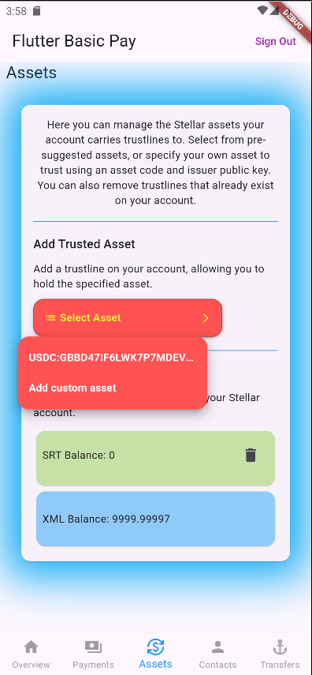

As soon as selected, the `Custom Asset` dialog appears. Here we have to insert the asset code and the issuer account id. Issued assets are defined by the asset code (the asset’s identifying code), that can have max. 12 characters and the asset issuer id. Please read more about assets in the [Stellar Docs Assets](https://developers.stellar.org/docs/learn/fundamentals/stellar-data-structures/assets) section.

As we are the issuers of the asset, we can call it however we want. Let's name it `GOLD`. `GOLD` is our asset code. The issuer account id is the public key that we generated before. Let's insert them into the `Custom Asset` dialog form:

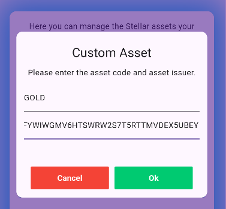

As soon as we press `Ok` our widget will display the asset in the format `asset_code:issuer_account_id` also called `canonical form`.

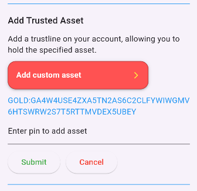

Now we can enter the pincode to add the trustline. After submitting the transaction to the Stellar Test Network, the asset appears in our list of existing balances:

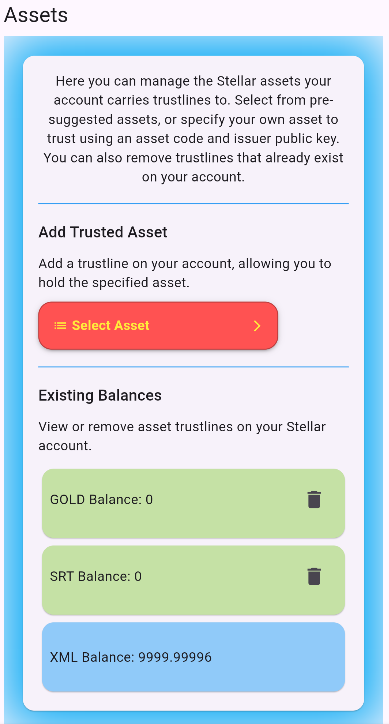

The implementaion is the same as above and the source code can be found in [assets_page.dart](https://github.com/Soneso/flutter_basic_pay/blob/main/lib/widgets/dashboard/assets/assets_page.dart).

Next, let send some `GOLD` from the issuer account to our user's account. To do so we use the [Stellar Laoboratory](https://laboratory.stellar.org/#?network=test) again.

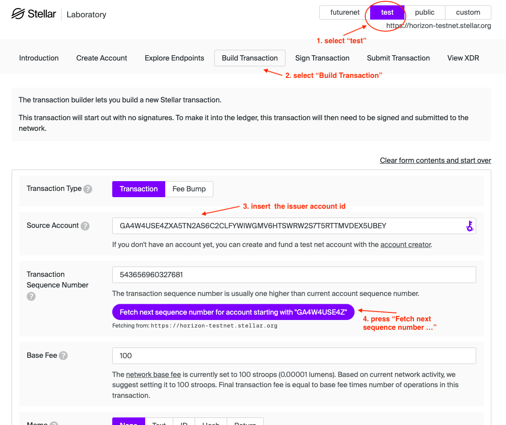


1. Select the `test` Network
2. Select the `Buld Transaction` tab
3. Paste the issuer account id into the `Source Account` field. (ours is `GA4W4USE4ZXA5TN2AS6C2CLFYWIWGMV6HTSWRW2S7T5RTTMVDEX5UBEY`)
4. Press the `Fetch next sequence number` button to get the sequence number for the transaction.

Scroll down:

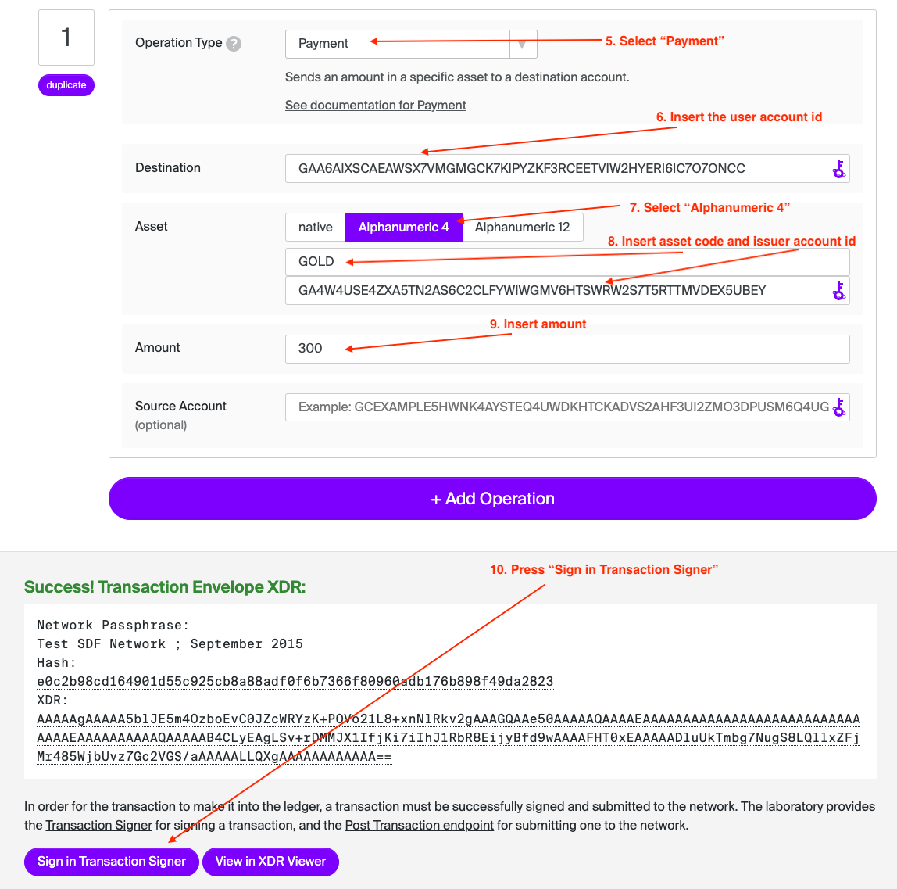

5. Select `Payment` as an operation type.
6. Insert the user account id as a destination for the payment. You can find it in the overview tab of the app on the `My Data` card:

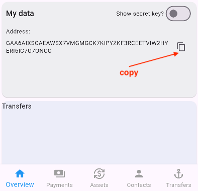

7. Select `Alphanumeric 4` asset.
8. Insert the asset code (`GOLD`) and our issuer account id (`GA4W4USE4ZXA5TN2AS6C2CLFYWIWGMV6HTSWRW2S7T5RTTMVDEX5UBEY`) to identify the asset.
9. Insert the amount of `GOLD` you would like to receive (e.g. 300)
10. Press `Sign in TransactionSigner` to sing and later submit the transaction to the Stellar Test Network.

Next page:

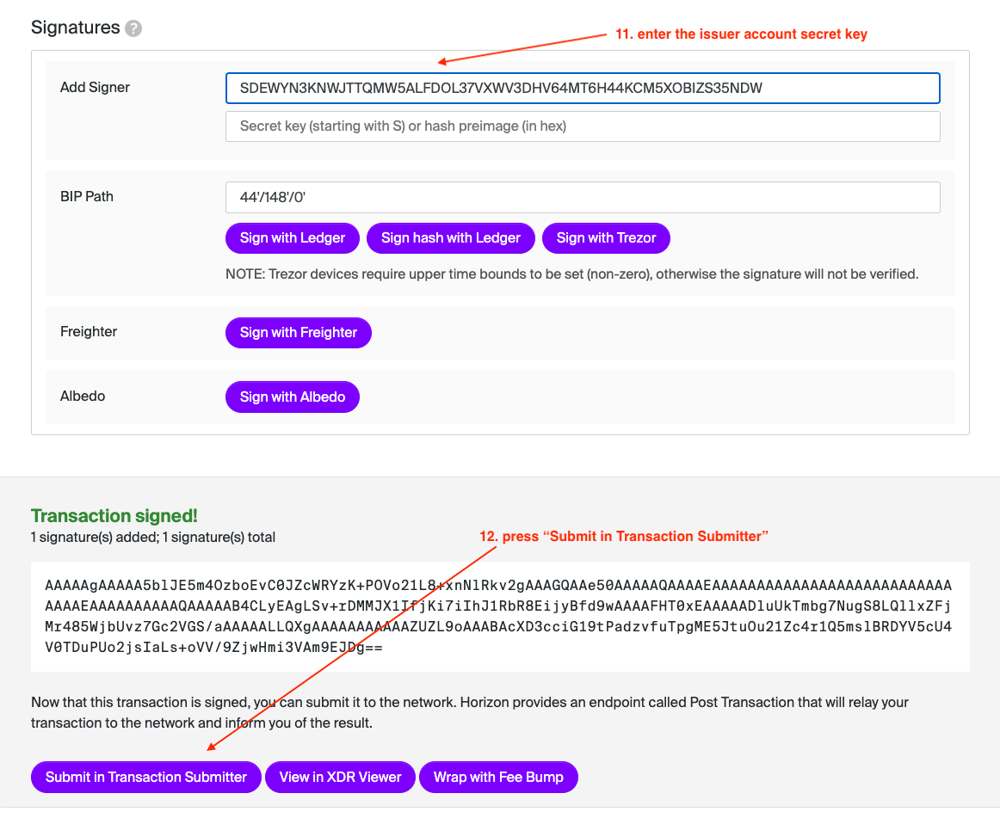

11. Insert the issuer account secret key into sign the transaction. (ours is `SDEWYN3KNWJTTQMW5ALFDOL37VXWV3DHV64MT6H44KCM5XOBIZS35NDW`)
12. Press the `Submit in Transaction Submitter` button to submit the signed transaction to the Stellar Test Network.
13. Press `Submit Transaction`

After the transaction has been submitted, we should have received the `GOLD` asset. Currently the app does not refresh automatically, so we must switch tabs to see the update. For example, switch to the `Assets` tab and then back to the `Overview`:


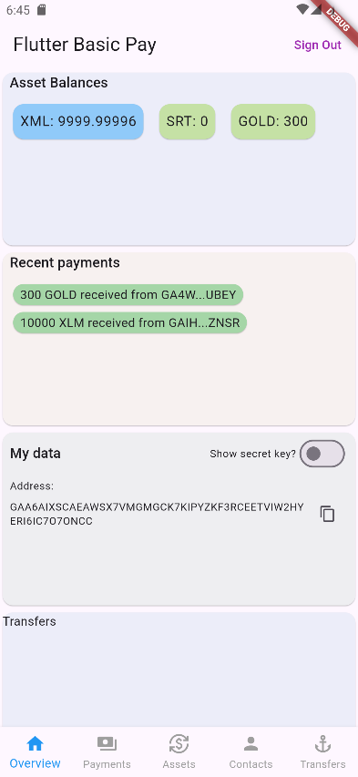


## Removing an asset

Trustlines can only be removed if the user holds a zero balance of the corresponding asset. For example, we hold 0 `SRT` which means that we can remove that trustline but we hold 300 `GOLD`and therefore we cannot remove the `GOLD` trustline.


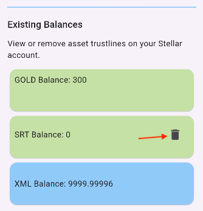

To remove the trustline, the user presses the `Trash` icon button. As soon as pressed, the [`PinForm`](https://github.com/Soneso/flutter_basic_pay/blob/main/lib/widgets/common/pin_form.dart) is displayed, so that the user can insert their pincode needed to decrypt their secret key that we need to sign the transaction.

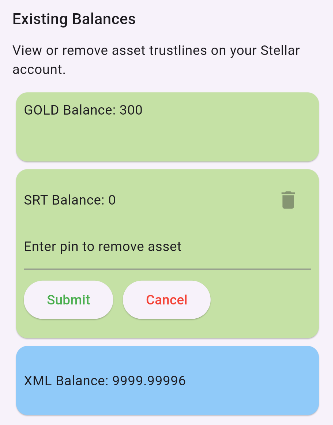

After entering the pincode, the app decrypts the secret key, builds, signs and submits the transaction to the Stellar Network.

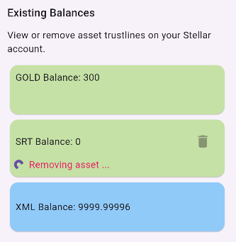

On success, the trustline has been removed and the UI has been updated:

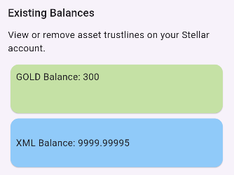


### Code implementation

The implementation is similar to the above shown implementation for adding an asset. But this time we can find the source code in the [`AssetBalanceCard`](https://github.com/Soneso/flutter_basic_pay/blob/main/lib/widgets/dashboard/assets/asset_balance_card.dart).

On Pin Set we first load the user keypair by using the pin and then remove the trustline:

```dart
Future<void> _handlePinSet(String pin, AssetBalanceCard widget) async {
    var beforeSendingState = _state;
    setState(() {
      _submitError = null;
      _state = CardState.sending;
    });
    try {
      // load secret seed and check if pin is valid.
      var userKeyPair = await widget.getUserKeyPair(pin);

      bool ok = await widget.removeAssetSupport(
          widget.asset.asset as wallet_sdk.IssuedAssetId, userKeyPair);
      if (!ok) {
        throw Exception("failed to submit");
      }
    } catch (e) {
      var errorText = "error: could not remove asset";
      if (e is RetrieveSeedException) {
        errorText = "error: invalid pin";
      }
      setState(() {
        _submitError = errorText;
        _state = beforeSendingState;
      });
    }
  }
```


`widget.removeAssetSupport` redirects to [`DashboardData.removeAssetSupport`](https://github.com/Soneso/flutter_basic_pay/blob/main/lib/api/api.dart):

```dart
/// Removes a trust line by using the wallet sdk, so that the user can not hold the
/// given [asset] any more. It only works if the user has a balance of 0
/// for the given asset. Requires the user's signing [userKeyPair] to
/// sign the transaction before sending it to the Stellar Network.
/// Returns true on success.
Future<bool> removeAssetSupport(wallet_sdk.IssuedAssetId asset,
    wallet_sdk.SigningKeyPair userKeyPair) async {
    var success = await StellarService.removeAssetSupport(asset, userKeyPair);

    // Wait for the ledger to close.
    await Future.delayed(const Duration(seconds: 5));

    // reload assets so that our data is updated.
    await loadAssets();

    return success;
}
```

In [`StellarService`](https://github.com/Soneso/flutter_basic_pay/blob/main/lib/services/stellar.dart):

```dart
/// Removes a trust line by using the wallet sdk, so that the user can not hold the
/// given [asset] any more. It only works if the user has a balance of 0
/// for the given asset. Requires the user's signing [userKeyPair] to
/// sign the transaction before sending it to the Stellar Network.
/// Returns true on success.
static Future<bool> removeAssetSupport(wallet_sdk.IssuedAssetId asset,
    wallet_sdk.SigningKeyPair userKeyPair) async {

    // build sign and submit transaction to stellar.
    var stellar = _wallet.stellar();
    var txBuilder = await stellar.transaction(userKeyPair);
    var tx = txBuilder.removeAssetSupport(asset).build();
    stellar.sign(tx, userKeyPair);
    return await stellar.submitTransaction(tx);

}
```

It uses the wallet sdk to build, sign and submit the transaction to the Stellar Test Network. 

After that, `DashboardData` reloads the user's assets and the UI gets updated.


# Next

Continue with [Payment](payment.md).


