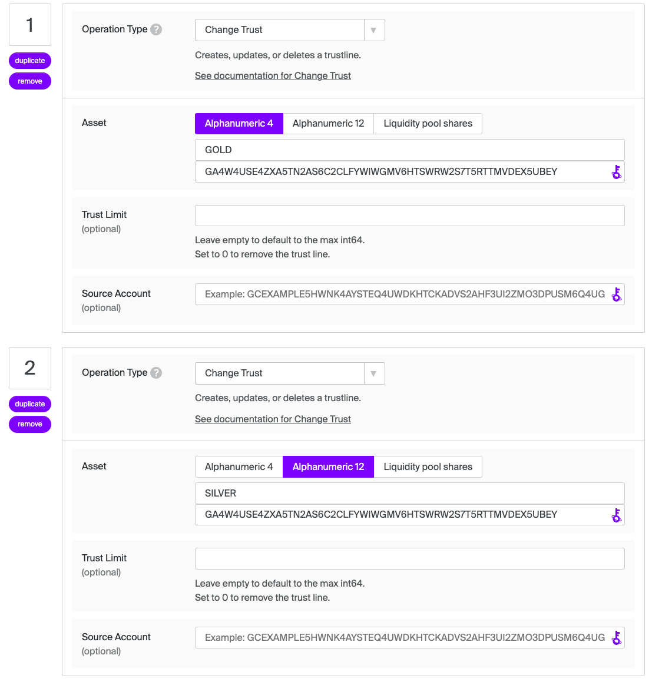
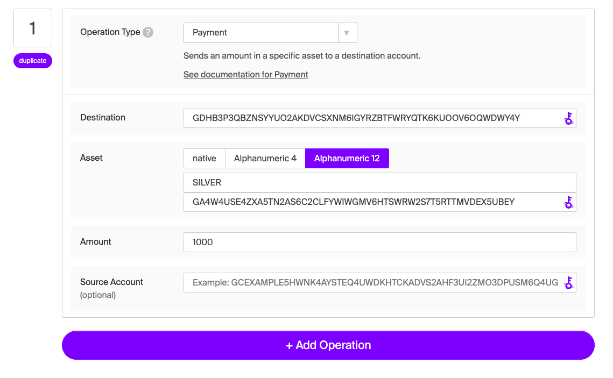

# Path payment

A path payment is where the asset sent can be different from the asset received. There are two possible path payment operations: 1) `path_payment_strict_send`, which allows the user to specify the amount of the asset to send, and 2) `path_payment_strict_receive`, which allows the user to specify the amount of the asset received. Read more in the Stellar's [Path Payments Encyclopedia Entry](https://developers.stellar.org/docs/learn/encyclopedia/transactions-specialized/path-payments).

With Flutter Basic Pay, the user sends a path payment by navigating to the [Payments page]((https://github.com/Soneso/flutter_basic_pay/blob/main/lib/widgets/dashboard/payments/payments_page.dart)), where they can select the Send and Receive Different Assets toggle. Then they can either select a user from their contacts or input the public key of a destination address. They then determine whether they want to specify the asset sent or received. Finally, they select the asset sent and the asset received and the amounts.

## Strict send

Allows a user to specify the amount of the asset to send. The amount received will vary based on offers in the order books and/or liquidity pools.

## Strict receive

Allows a user to specify the amount of the asset received. The amount sent will vary based on the offers in the order books/liquidity pools.

## Preparing data for our test

In order to test the path payment functionality, we will first prepare the test data for it. We will use the [Stellar Lab](https://laboratory.stellar.org/#?network=test) to do so. We have already used it the chapter [manage tust](manage_trust.md) to make our user account trust the asset `GOLD` and transfer some `GOLD` to our user. 

### Create recipient account

Next, we will create a new account that will trust the asset `SILVER` of the same issuer as in the [manage tust](manage_trust.md) chapter and transfer some SILVER to the new user. We will add his Stellar address to our contacts and use it as the recipient account. We will call the new contact `James`.

First let's create the new account for `James` and fund it on testnet:

Next, let's trust `SILVER` from the issuer `GA4W4USE4ZXA5TN2AS6C2CLFYWIWGMV6HTSWRW2S7T5RTTMVDEX5UBEY`:

Now James can receive `SILVER:GA4W4USE4ZXA5TN2AS6C2CLFYWIWGMV6HTSWRW2S7T5RTTMVDEX5UBEY`

### Add recipient account to contacts

On the contracts page, we can add the new recipient account to our list of contacts by entering his name (`James`) and his Stellar address.

This will add the recipient to or list of contracts by storing the data in the secure storage and then update our `DashboardData`. The code can be found in [contacts_page.dart](https://github.com/Soneso/flutter_basic_pay/blob/main/lib/widgets/dashboard/contacts/contacts_page.dart).

### Create an account that trades GOLD for SILVER

To be able to send path payments we need offers in the order book or in liquidity pools. For our test, we will create a simple offer in the order book that can be used to trade `GOLD` against `SILVER`. Like in the steps before, we first create and fund a new account. Then we let it trust `GOLD` and `SILVER` from our issuer account and then send 1000 `SILVER` from our issuer account to our new account, so that it can later create an offer that sells `SILVER` for `GOLD`. 

Change trust:

Issuer sends `SILVER` to the trader account:

Now, that our trading account holds `SILVER`, we can create a sell offer by using its address as a source account:

The trader account sells `SILVER` for `GOLD` at a price of 0.1 units of `GOLD` for 1 unit of `SILVER`.

## Path Payment UI

Now, that the test data is prepared, let's have a look to the path payment UI. If the user activates the `Send and Receive Different Assets toggle` the UI in the [payments_page.dart](https://github.com/Soneso/flutter_basic_pay/blob/main/lib/widgets/dashboard/payments/payments_page.dart) will update and display the [PathPaymentsBodyContent](https://github.com/Soneso/flutter_basic_pay/blob/main/lib/widgets/dashboard/payments/path_payments_body.dart).

