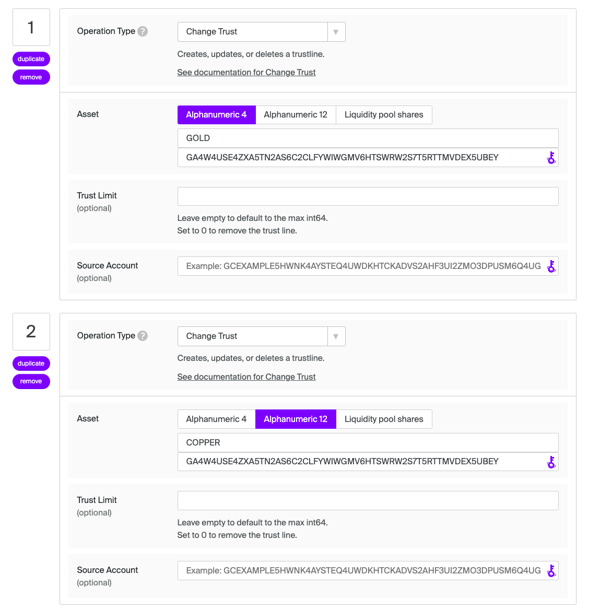

# Path payment

A path payment is where the asset sent can be different from the asset received. There are two possible path payment operations: 1) `path_payment_strict_send`, which allows the user to specify the amount of the asset to send, and 2) `path_payment_strict_receive`, which allows the user to specify the amount of the asset received. Read more in the Stellar's [Path Payments Encyclopedia Entry](https://developers.stellar.org/docs/learn/encyclopedia/transactions-specialized/path-payments).

With Flutter Basic Pay, the user sends a path payment by navigating to the [Payments page]((https://github.com/Soneso/flutter_basic_pay/blob/main/lib/widgets/dashboard/payments/payments_page.dart)), where they can select the Send and Receive Different Assets toggle. Then they can either select a user from their contacts or input the public key of a destination address. They then determine whether they want to specify the asset sent or received. Finally, they select the asset sent and the asset received and the amounts.


## Strict send

Allows a user to specify the amount of the asset to send. The amount received will vary based on offers in the order books and/or liquidity pools.


## Strict receive

Allows a user to specify the amount of the asset received. The amount sent will vary based on the offers in the order books/liquidity pools.


## Preparing data for our test

In order to test the path payment functionality, we will first prepare the test data for it. We will use the [Stellar Lab](https://laboratory.stellar.org/#?network=test) to do so. We have already used it the chapter [manage tust](manage_trust.md) to make our user account trust the asset `GOLD` and transfer some `GOLD` to our user. 

### Create recipient account

Next, we will create a new account that will trust the asset `SILVER` of the same issuer as in the [manage tust](manage_trust.md) chapter and transfer some SILVER to the new user. We will add his Stellar address to our contacts and use it as the recipient account. We will call the new contact `James`.

First let's create the new account for `James` and fund it on testnet:


Next, let's trust `SILVER` from the issuer `GA4W4USE4ZXA5TN2AS6C2CLFYWIWGMV6HTSWRW2S7T5RTTMVDEX5UBEY`:


Now James can receive `SILVER:GA4W4USE4ZXA5TN2AS6C2CLFYWIWGMV6HTSWRW2S7T5RTTMVDEX5UBEY`

### Add recipient account to contacts

On the contracts page, we can add the new recipient account to our list of contacts by entering his name (`James`) and his Stellar address.


This will add the recipient to or list of contracts by storing the data in the secure storage and then update our `DashboardData`. The code can be found in [contacts_page.dart](https://github.com/Soneso/flutter_basic_pay/blob/main/lib/widgets/dashboard/contacts/contacts_page.dart).

### Create trading accounts

To be able to send path payments we need offers in the order book or in liquidity pools. For our test, we will create two offers in the order book that can be used to trade `GOLD` against `SILVER`. Like in the steps before, we first create and fund two new accounts. Then, we let the first one trust `GOLD` and `COPPER` from our issuer account and the second one trust `COPPER` and `SILVER`.

Change trust for the first trader (`GOLD` and `COPPER`):



Change trust for the second trader (`COPPER` and `SILVER`):


Next, lets fund the trader accounts, so that we can create the offers. Issuer sends 10.000 `COPPER` to the first trader account and 1.000 `SILVER`to the second trader account:


Now, that our first trading account holds `COPPER`, we can create a sell offer by using its address as a source account:


The first trader account sells `COPPER` for `GOLD` at a price of 0.01 units of `GOLD` for 1 unit of `COPPER`.

The second trading account sells `SILVER` for `COPPER`:


They sell `SILVER` for `COPPER` at a price of 10 units of `COPPER` for 1 unit of `SILVER`.

### Summary

Now we have following test data:

1. User account trusts `GOLD` and has a balanace of 300 `GOLD`.
2. Recipient account: `James` created and added to the contacts. `James` trusts and therefore can receive `SILVER`.
3. First trader account trusts `GOLD` and `COPPER` and sells `COPPER` for `GOLD` at a price of 0.01 units of `GOLD` for 1 unit of `COPPER`.
4. Second trader account trusts `COPPER` and `SILVER` and sells `SILVER` for `COPPER` at a price of 10 units of `COPPER` for 1 unit of `SILVER`.

What we want to achieve is that our user account sends `GOLD` and the recipient account receives `SILVER`. This is now possible by using the traders offers in the order book via the following payment path:

`GOLD` -> `COPPER` -> `SILVER` 


## Path Payment UI

Now, that the test data is prepared, let's have a look to the path payment UI. If the user activates the `Send and Receive Different Assets toggle` the UI in the [payments_page.dart](https://github.com/Soneso/flutter_basic_pay/blob/main/lib/widgets/dashboard/payments/payments_page.dart) will update and display the [PathPaymentsBodyContent](https://github.com/Soneso/flutter_basic_pay/blob/main/lib/widgets/dashboard/payments/path_payments_body.dart).


The user's list of assets and contacts has already been loaded in the [payments page]((https://github.com/Soneso/flutter_basic_pay/blob/main/lib/widgets/dashboard/payments/payments_page.dart)). Therefore, we can now also display the list of contacts in a dropdown so that the user can select the recipient.


Next, let's select `James` as a recipient from our contact list.


As soon as a contact is selected or another recipient address is entered, the list of the recipient's Stellar assets (`destinationAssets`) is loaded from the Stellar Test Network. We need it to be able to display the recipient assets dropdown later.

```dart
Future<void> _handleContactSelected(
      String item, DashboardState dashboardState) async {
    
    //...

    var destinationAssets =
        await StellarService.loadAssetsForAddress(address);
    if (destinationAssets.isEmpty) {
      setState(() {
        _submitError =
            'The recipient account was not found on the Stellar Network. It needs to be funded first.';
        _state = PathPaymentsBodyState.contactNotValid;
      });
    }

    ///...
}
```


In [`StellarService`](https://github.com/Soneso/flutter_basic_pay/blob/main/lib/services/stellar.dart):

```dart
/// Loads the assets for a given account specified by [address] from the
/// Stellar Network by using the wallet sdk.
static Future<List<AssetInfo>> loadAssetsForAddress(String address) async {
    var loadedAssets = List<AssetInfo>.empty(growable: true);
    try {
        var stellarAccountInfo =
        await _wallet.stellar().account().getInfo(address);
        for (var balance in stellarAccountInfo.balances) {
            loadedAssets.add(AssetInfo(
                asset: wallet_sdk.StellarAssetId.fromAsset(balance.asset),
                balance: balance.balance,
            ));
        }
    } on wallet_sdk.ValidationException {
        // account does not exist
        loadedAssets = List<AssetInfo>.empty(growable: true);
    }
    return loadedAssets;
}
```

Depending on whether we have selected `strict send` or `strict receive`, we can now select the corresponding asset from the dropdown. 

See: [`PathPaymentSwitcher`](https://github.com/Soneso/flutter_basic_pay/blob/main/lib/widgets/dashboard/payments/path_payments_body.dart).

```dart
strictSend
    ? PathPaymentSection(
        type: PathPaymentType.strictSend,
        destinationAddress: widget.destinationAddress,
        destinationAssets: widget.destinationAssets,
        onPathSelected: (pathData) =>
            _handlePathSelected(pathData),
        key: const Key('strict send'),
        )
    : PathPaymentSection(
        type: PathPaymentType.strictReceive,
        destinationAddress: widget.destinationAddress,
        destinationAssets: widget.destinationAssets,
        onPathSelected: (pathData) =>
            _handlePathSelected(pathData),
        key: const Key('strict receive'),
        )
```

### Strict send

In the following, we use `strict send` so that the list of our user assets is displayed in the dropdown. 

Let's select `GOLD` as the asset we would like to send. 


As soon as we select the asset to send, we display the amount form, where the user can insert the amount that they want to send. It also shows the `Find payment path` button. Before sending a path payment we should first find the possible paths using the wallet sdk. It is important, because then we can see if a payment is possible and if multiple paths are available, we can let the user choose a path including the destination asset.

Let's insert 20 `GOLD` as the strict send amount and press the `Find payment path` button. The app will search for the possible payment paths and display the result. 

Because there is only one possible path in our case, we only show this one:


**Source code:**

```dart
Future<void> _handleFindPaymentPath(
      String amount, DashboardState dashboardState) async {
    setState(() {
      _state = SectionState.searchingPaths;
    });

    var asset = _selectedAsset == xlmAsset
        ? wallet_sdk.NativeAssetId()
        : (_assets.firstWhere((a) => a.asset.id == _selectedAsset)).asset;

    var paths = List<wallet_sdk.PaymentPath>.empty(growable: true);
    if (widget.type == PathPaymentType.strictSend) {
      paths = await StellarService.findStrictSendPaymentPath(
          sourceAsset: asset,
          sourceAmount: amount,
          destinationAddress: widget.destinationAddress);
    } else {
      paths = await StellarService.findStrictReceivePaymentPath(
          sourceAddress: dashboardState.data.userAddress,
          destinationAsset: asset, destinationAmount: amount);
    }
    if (paths.isEmpty) {
      setState(() {
        _errorText = 'No payment path found for the given data';
        _state = SectionState.initial;
      });
    } else {
      setState(() {
        _errorText = null;
        _state = SectionState.initial;
      });

      // in a real app you would let the user select the path
      // for now, we just take the first.
      widget.onPathSelected(PathData(type: widget.type, path: paths.first));
    }
  }
```

In [`StellarService`](https://github.com/Soneso/flutter_basic_pay/blob/main/lib/services/stellar.dart):

```dart
/// Searches for a strict send payment path by using the wallet sdk.
/// Requires the [sourceAsset] + [sourceAmount] and the [destinationAddress]
/// of the recipient.
static Future<List<wallet_sdk.PaymentPath>> findStrictSendPaymentPath(
    {required wallet_sdk.StellarAssetId sourceAsset,
    required String sourceAmount,
    required String destinationAddress}) async {
    var stellar = _wallet.stellar();
    return await stellar.findStrictSendPathForDestinationAddress(
        sourceAsset, sourceAmount, destinationAddress);
}
```

We use the wallet sdk to find the possible paths. As arguments we need the asset to be sent and amount, and also the address of the recipient.
The result is a list of possible paths, each stored in a `wallet_sdk.PaymentPath` object:

```dart
class PaymentPath {
  String sourceAmount;
  StellarAssetId sourceAsset;

  String destinationAmount;
  StellarAssetId destinationAsset;

  List<StellarAssetId> path;

  PaymentPath(this.sourceAmount, this.sourceAsset, this.destinationAmount,
      this.destinationAsset, this.path);
 
 //...

}
```
If the list contains several entries, these can be made available to the user for selection. In our case, there is only one entry, which we have displayed immediately.

Now the user can enter their pin, so that we can decrypt their signing key, sign the transaction and send the transaction to the Stellar Network.

As soon as the transaction has been successfully sent, we inform the user and they can see the payment in our `Recent payments` overview:

```dart
Future<void> _handlePinSet(
      PaymentDataAndPin data, DashboardState dashboardState) async {
    var nextState = _state;
    setState(() {
      _submitError = null;
      _state = PathPaymentsBodyState.sending;
    });
    try {
      // load secret key and check if pin is valid.
      var userKeyPair = await dashboardState.authService.userKeyPair(data.pin);

      var pathData = _pathData!;
      final ok = pathData.type == PathPaymentType.strictSend
          ? await dashboardState.data.strictSendPayment(
              sendAssetId: pathData.path.sourceAsset,
              sendAmount: pathData.path.sourceAmount,
              destinationAddress: _recipientAddress!,
              destinationAssetId: pathData.path.destinationAsset,
              destinationMinAmount: pathData.path.destinationAmount,
              path: pathData.path.path,
              userKeyPair: userKeyPair)
          : await dashboardState.data.strictReceivePayment(
              sendAssetId: pathData.path.sourceAsset,
              sendMaxAmount: pathData.path.sourceAmount,
              destinationAddress: _recipientAddress!,
              destinationAssetId: pathData.path.destinationAsset,
              destinationAmount: pathData.path.destinationAmount,
              path: pathData.path.path,
              userKeyPair: userKeyPair);

      if (ok) {
        ScaffoldMessenger.of(NavigationService.navigatorKey.currentContext!)
            .showSnackBar(
          const SnackBar(
            content: Text('Payment sent!'),
            backgroundColor: Colors.green,
          ),
        );
      }
    } catch (e) {
      var errorText = "error: could not send payment";
      if (e is InvalidPin) {
        errorText = "error: invalid pin";
      }
      setState(() {
        _submitError = errorText;
        _state = nextState;
      });
    }
  }
```

We use our [auth service](authentication.md) to get the user's secret key and our instance of `DashboardData` (see [dashboard_data](dashboard_data.md) and [dashboard_state](dashboard_state.md) ) to build, sign and send the transaction to the Stellar Network.


In [DashboardData](https://github.com/Soneso/flutter_basic_pay/blob/main/lib/services/data.dart): 

```dart
/// Sends a strict send path payment by using the wallet sdk.
/// Requires the [sendAssetId] representing the asset to send,
/// strict [sendAmount] and the [destinationAddress] of the
/// recipient. [destinationAssetId] representing the destination asset,
/// the [destinationMinAmount] to be received and the assets [path] from the
/// payment path previously obtained by [findStrictSendPaymentPath]. Optional
/// text [memo] and and the signing [userKeyPair] needed to sign
/// the transaction before submission.
/// Returns true on success.
Future<bool> strictSendPayment(
    {required wallet_sdk.StellarAssetId sendAssetId,
    required String sendAmount,
    required String destinationAddress,
    required wallet_sdk.StellarAssetId destinationAssetId,
    required String destinationMinAmount,
    required List<wallet_sdk.StellarAssetId> path,
    String? memo,
    required wallet_sdk.SigningKeyPair userKeyPair}) async {

    bool success = await StellarService.strictSendPayment(
        sendAssetId: sendAssetId,
        sendAmount: sendAmount,
        destinationAddress: destinationAddress,
        destinationAssetId: destinationAssetId,
        destinationMinAmount: destinationMinAmount,
        path: path,
        userKeyPair: userKeyPair);

    // Wait for the ledger to close
    await Future.delayed(const Duration(seconds: 5));

    // Reload assets and recent payments, so that our data is updated.
    await loadAssets();
    await loadRecentPayments();

    return success;
}
```

In [`StellarService`](https://github.com/Soneso/flutter_basic_pay/blob/main/lib/services/stellar.dart):


```dart
/// Sends a strict send path payment by using the wallet sdk.
/// Requires the [sendAssetId] representing the asset to send,
/// strict [sendAmount] and the [destinationAddress] of the
/// recipient. [destinationAssetId] representing the destination asset,
/// the [destinationMinAmount] to be received and the assets [path] from the
/// payment path previously obtained by [findStrictSendPaymentPath]. Optional
/// text [memo] and and the signing [userKeyPair] needed to sign
/// the transaction before submission.
/// Returns true on success.
static Future<bool> strictSendPayment(
    {required wallet_sdk.StellarAssetId sendAssetId,
    required String sendAmount,
    required String destinationAddress,
    required wallet_sdk.StellarAssetId destinationAssetId,
    required String destinationMinAmount,
    required List<wallet_sdk.StellarAssetId> path,
    String? memo,
    required wallet_sdk.SigningKeyPair userKeyPair}) async {

    // Build, sign and submit transaction to stellar.
    var stellar = _wallet.stellar();
    var txBuilder = await stellar.transaction(userKeyPair);
    txBuilder = txBuilder.strictSend(
        sendAssetId: sendAssetId,
        sendAmount: sendAmount,
        destinationAddress: destinationAddress,
        destinationAssetId: destinationAssetId,
        destinationMinAmount: destinationMinAmount,
        path: path);
    
    if (memo != null) {
        txBuilder = txBuilder.setMemo(core_sdk.MemoText(memo));
    }

    var tx = txBuilder.build();
    stellar.sign(tx, userKeyPair);

    return await stellar.submitTransaction(tx);
}
```

### Strict receive

Strict receive is similar to strict send described above, with the difference that the user must select the asset to be received.


We have selected `SILVER` as a destination asset from the dropdown of destination assets that `James` can receive. We must now enter the amount that `James` should (strict) receive. Next, we enter 100 `SILVER` and let the app search for a payment path path with the help of the wallet sdk.


The app found a payment path and displays it to the user.

In [`StellarService`](https://github.com/Soneso/flutter_basic_pay/blob/main/lib/services/stellar.dart):

```dart
/// Searches for a strict receive payment path by using the wallet sdk.
/// Requires the [sourceAddress] (account id of the sending account),
/// [destinationAsset] and [destinationAmount].
/// It will search for all source assets hold by the user.
static Future<List<wallet_sdk.PaymentPath>> findStrictReceivePaymentPath(
    {required String sourceAddress,
    required wallet_sdk.StellarAssetId destinationAsset,
    required String destinationAmount}) async {

    var stellar = _wallet.stellar();
    return await stellar.findStrictReceivePathForSourceAddress(
        destinationAsset, destinationAmount, sourceAddress);
}
```

After the user enters their pincode and presses `Submit`, the transaction is prepared and sent to the Stellar Network.


In [`StellarService`](https://github.com/Soneso/flutter_basic_pay/blob/main/lib/services/stellar.dart):

```dart
///Sends a strict receive path payment by using the wallet sdk.
/// Requires the [sendAssetId] representing the asset to send,
/// [sendMaxAmount] and the [destinationAddress] of the
/// recipient. [destinationAssetId] representing the destination asset,
/// the strict [destinationAmount] to be received and the assets [path]
/// from the payment path previously obtained by [findStrictSendPaymentPath].
/// Optional text [memo] and and the signing [userKeyPair] needed to sign
/// the transaction before submission.
/// Returns true on success.
static Future<bool> strictReceivePayment(
    {required wallet_sdk.StellarAssetId sendAssetId,
    required String sendMaxAmount,
    required String destinationAddress,
    required wallet_sdk.StellarAssetId destinationAssetId,
    required String destinationAmount,
    required List<wallet_sdk.StellarAssetId> path,
    String? memo,
    required wallet_sdk.SigningKeyPair userKeyPair}) async {

    // Build, sign and submit transaction to stellar.
    var stellar = _wallet.stellar();
    var txBuilder = await stellar.transaction(userKeyPair);
    txBuilder = txBuilder.strictReceive(
        sendAssetId: sendAssetId,
        sendMaxAmount: sendMaxAmount,
        destinationAddress: destinationAddress,
        destinationAssetId: destinationAssetId,
        destinationAmount: destinationAmount,
        path: path);
    
    if (memo != null) {
        txBuilder = txBuilder.setMemo(core_sdk.MemoText(memo));
    }

    var tx = txBuilder.build();
    stellar.sign(tx, userKeyPair);
    
    return await stellar.submitTransaction(tx);
}
```

As soon as the transaction has been successfully sent, we inform the user and they can see the payment in our `Recent payments` overview:


# Next

Continue with [Anchor integration](anchor_integration.md).
