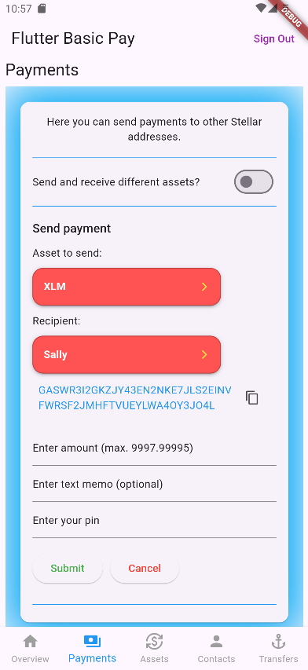
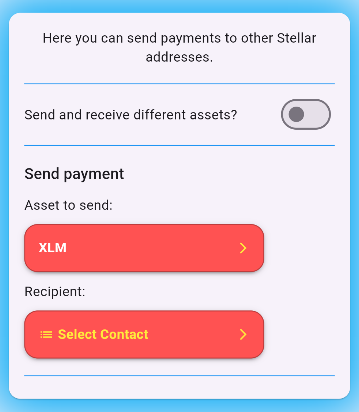
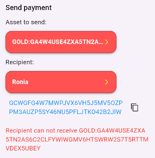
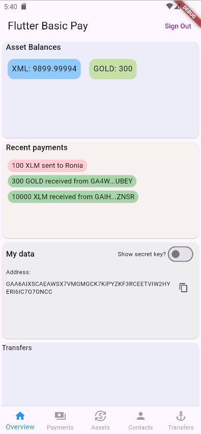

# Payment

A payment operation sends an amount in a specific asset (XLM or non-XLM) to a destination account. With a basic payment operation, the asset sent is the same as the asset received. Flutter Basic Pay also allows for path payments (where the asset sent is different than the asset received), which we’ll talk about in the next section.

In our Flutter Basic Pay application, the user will navigate to the Payments page where can either select a user from their contacts or input the public key of a destination address with a specified asset they’d like to send along with the amount of the asset and an optional text memo.



After the user enters the required data, they press the `Submit` button. If the destination account exists and is properly funded with XLM, this will trigger a payment transaction.


## Code implementation

The PaymentsPage widget can be found in [payments_payge.dart](https://github.com/Soneso/flutter_basic_pay/blob/main/lib/widgets/dashboard/payments/payments_page.dart). 

To be able to fill the form, it needs to load the available assets that the user holds and their contacts.

```dart
Widget build(BuildContext context) {
    var dashboardState = Provider.of<DashboardState>(context);
    return FutureBuilder<List<AssetInfo>>(
      future: dashboardState.data.loadAssets(),
      builder: (context, futureSnapshot) {
        if (!futureSnapshot.hasData) {
          return const Center(
            child: CircularProgressIndicator(),
          );
        }
        return StreamBuilder<List<AssetInfo>>(
          initialData: futureSnapshot.data,
          stream: dashboardState.data.subscribeForAssetsInfo(),
          builder: (context, assetsSnapshot) {
            if (assetsSnapshot.data == null) {
              return const Center(
                child: CircularProgressIndicator(),
              );
            }
            return FutureBuilder<List<ContactInfo>>(
              future: dashboardState.data.loadContacts(),
              builder: (context, futureSnapshot) {
                if (!futureSnapshot.hasData) {
                  return const Center(
                    child: CircularProgressIndicator(),
                  );
                }
                return StreamBuilder<List<ContactInfo>>(
                  initialData: futureSnapshot.data,
                  stream: dashboardState.data.subscribeForContacts(),
                  builder: (context, contactsSnapshot) {
                    if (contactsSnapshot.data == null) {
                      return const Center(
                        child: CircularProgressIndicator(),
                      );
                    }
                    var key = List<Object>.empty(growable: true);
                    key.addAll(assetsSnapshot.data!);
                    key.addAll(contactsSnapshot.data!);
                    return PaymentsPageBody(key: ObjectKey(key));
                  },
                );
              },
            );
          },
        );
      },
    );
}
```

First we use our [`DashboardData`](https://github.com/Soneso/flutter_basic_pay/blob/main/lib/services/data.dart) instance (see [dashboard data](dashboard_data.md) and [dashboard state](dashboard_state.md)) to load the assets that the user holding. They are needed to fill the assets dropdown, so that the user can choose the asset for the payment. During the loading, a circular progress indicator is shown. As soon as the assets are loaded, we subscribe for updates on the assets, so that we can update the UI if needed. Next, we load the users contacts in the same way. They are needed for the contacts dropdown, so that the user can choose a contact as the recipient of the payment. As soon as the needed data is loaded, the widget `PaymentsPageBody` can be displayed.


Let's first have a look, how the assets that the user holds are loaded from the Stellar Network using our [`DashboardData`](https://github.com/Soneso/flutter_basic_pay/blob/main/lib/services/data.dart) - `dashboardState.data` instance.

```dart
    /// Loads the users assets from the Stellar Network
Future<List<AssetInfo>> loadAssets() async {
    assets = await StellarService.loadAssetsForAddress(userAddress);
    _emitAssetsInfo();
    return assets;
}   
```

In [`StellarService`](https://github.com/Soneso/flutter_basic_pay/blob/main/lib/services/stellar.dart):

```dart
/// Loads the assets for a given account specified by [address] from the
/// Stellar Network by using the wallet sdk.
static Future<List<AssetInfo>> loadAssetsForAddress(String address) async {
    var loadedAssets = List<AssetInfo>.empty(growable: true);
    try {
        var stellarAccountInfo =
        await _wallet.stellar().account().getInfo(address);
        for (var balance in stellarAccountInfo.balances) {
            loadedAssets.add(AssetInfo(
                asset: wallet_sdk.StellarAssetId.fromAsset(balance.asset),
                balance: balance.balance,
            ));
        }
    } on wallet_sdk.ValidationException {
        // account does not exist
        loadedAssets = List<AssetInfo>.empty(growable: true);
    }
    return loadedAssets;
}
```

We are using the wallet sdk to load the account info for our user, because it contains the balances of all trusted assets.
For each balance we create a new `AssetInfo` object and add it to our list:

```dart
class AssetInfo {
  wallet_sdk.StellarAssetId asset;
  String balance;

  AssetInfo({required this.asset, required this.balance});
}
```
Next we cache the loaded assets in our `DashboardData` member variable `assets` and emit an event to let all subscribed listeners know that the data has been updated.

```dart
/// Emit updates on the list of assets the user holds.
/// E.g. asset added, balance changed.
void _emitAssetsInfo() {
    _assetsInfoStreamController.add(assets);
}
```

See also [dashboard data](dashboard_data.md) and [dashboard state](dashboard_state.md).


In the [`PaymentsPageBody`](https://github.com/Soneso/flutter_basic_pay/blob/main/lib/widgets/dashboard/payments/payments_page.dart) widget, widget first checks if the assets list is filled. It must contain at least the native asset (XLM). If not, the assets could not be loaded because the user account does not yet exist on the Stellar Network. In this case the widget informs the user and gives them the possibility to fund their account on the Stellar Test Network by using Friendbot.

```dart
child: dashboardState.data.assets.isEmpty
    ? Column(
        crossAxisAlignment: CrossAxisAlignment.start,
        children: [
        Text(
            "Your account does not exist on the Stellar Test Network and needs to be funded!",
            style: Theme.of(context).textTheme.bodyMedium),
        const SizedBox(height: 10),
        ElevatedButton(
            onPressed: () async {
            if (waitForAccountFunding) {
                return;
            }
            setState(() {
                waitForAccountFunding = true;
            });
            dashboardState.data.fundUserAccount();
            },
            child: waitForAccountFunding
                ? const SizedBox(
                    height: 15,
                    width: 15,
                    child: CircularProgressIndicator(),
                )
                : const Text('Fund on testnet',
                    style: TextStyle(color: Colors.purple)),
        ),
        ],
    )
    : SingleChildScrollView( //...)
```

You can read more about how the funding of the account works in the [Account creation](account_creation.md) section of this tutorial.
As soon as the account is funded, our `DashboardData` instance will load again the asset and emit the corresponding event causing the 
`paymentsPage` widget to rebuild the UI. Now we have a non-empty list of assets and can display our payment page.

`PaymentsPageBody` displays a switch, asking the user if they like to send and receive different assets. If on, the path payments widget is displayed.
Otherwise the normal payment widget is displayed. 

Let's first have a look to the normal payments widget which is called [`SimplePaymentsPageBodyContent`](https://github.com/Soneso/flutter_basic_pay/blob/main/lib/widgets/dashboard/payments/simple_payments_body.dart).





The `Asset to send` dropdown is filled with the assets received from `DashboardData`. All assets that have a balance of zero are excluded.
The `recipient` dropdown is filled from the list of contacts, also provided by `DashboardData`. The dropdown also contains an item called `Other`. If selected,
the app let`s the user insert the Stellar address of the recipient.

As soon as the recipient is selected, the UI displays the form fields to let the user provide the amount, optional memo and pin code. The pin code is needed to obtain the user`s 
signing keypair from the `AuthService` so that the transaction can be signed before submitting it to the Stellar Network.


The form fields are implemented in the [`PaymentDataAndPinForm`](https://github.com/Soneso/flutter_basic_pay/blob/main/lib/widgets/dashboard/payments/payment_data_and_pin_form.dart) widget. 

As soon as the data has been correctly provided by the user and the user pressed the `Submit` button, the payment transaction is prepared, signed, and send to the Stellar Network:

In `SimplePaymentsPageBodyContent`:

```dart
Future<void> _handleAmountAndPinSet(PaymentDataAndPin data, DashboardState dashboardState) async {

    //...

    // load secret key and check if pin is valid.
    var userKeyPair = await dashboardState.authService.userKeyPair(data.pin);

    // compose the asset
    var asset = _selectedAsset == xlmAsset
        ? wallet_sdk.NativeAssetId()
        : (assets.firstWhere((a) => a.asset.id == _selectedAsset)).asset;

    var destinationAddress = _recipientAddress!;

    // if the destination account does not exist on the testnet, let's fund it!
    // alternatively we can use the create account operation.
    var destinationExists =
        await StellarService.accountExists(destinationAddress);
    if (!destinationExists) {
        wait StellarService.fundTestNetAccount(destinationAddress);
    }


    // find out if the recipient can receive the asset that
    // the user wants to send
    if (asset is wallet_sdk.IssuedAssetId) {
    var recipientAssets = await StellarService.loadAssetsForAddress(destinationAddress);
        if (!recipientAssets.any((item) => item.asset.id == asset.id)) {
            setState(() {
                _submitError = 'Recipient can not receive ${asset.id}';
                _state = initialState;
            });
            return;
        }
    }

    // send payment
    bool ok = await dashboardState.data.sendPayment(
        destinationAddress: destinationAddress,
        assetId: asset,
        amount: data.amount!,
        memo: data.memo,
        userKeyPair: userKeyPair);
    
    //...
)
```

First we get the signing keypair of the user with the help of the `AuthService`. If this does not work because the pin code entered is incorrect, an exception is thrown and we can display the error to the user. 

We then evaluate the selection of the asset item from the dropdown and retrieve the corresponding asset object from our user's list of assets.

Next, we want to find out whether the Stellar address of the recipient exists in the Stellar network, i.e., whether it has already been funded. We can only send a payment to a Stellar account that already exists. Now, let's see how we can find out:

In [`StellarService`](https://github.com/Soneso/flutter_basic_pay/blob/main/lib/services/stellar.dart):

```dart
/// Check if an account for the given [address] exists on the Stellar Network.
static Future<bool> accountExists(String address) async {
    return await _wallet.stellar().account().accountExists(address);
}
```

The wallet sdk gives us the possibility to find out very easily.

If the account does not exist in the Stellar Test Network, we ask the Friendbot by using the wallet sdk to fund the account. 

In [`StellarService`](https://github.com/Soneso/flutter_basic_pay/blob/main/lib/services/stellar.dart):

```dart
/// Funds the account given by [address] on the Stellar Test Network by using Friendbot.
static Future<bool> fundTestNetAccount(String address) async {
    // fund account
    return await _wallet.stellar().account().fundTestNetAccount(address);
}
```

Of course, this only works in the Stellar Test Network.  But there are alternatives that also work in the Public Stellar Network. Firstly, we could ask the recipient to fund their account before we make the payment. On the other hand, we can use the `Create Account` operation to create the recipient's account by using our own funds. This must be at least 1 XLM.

In [`StellarService`](https://github.com/Soneso/flutter_basic_pay/blob/main/lib/services/stellar.dart):

```dart
/// Submits a transaction to the Stellar Network that funds an account
/// for the [destinationAddress]. The [startingBalance] must be min.
/// one XLM. The signing [userKeyPair] needed to sign the transaction before submission.
/// The stellar address from [userKeyPair] will be used as the source account
/// of the transaction.
static Future<bool> createAccount(
    {required String destinationAddress,
    String? memo,
    String startingBalance = "1",
    required wallet_sdk.SigningKeyPair userKeyPair}) async {

    // Build, sign and submit transaction to stellar.
    var stellar = _wallet.stellar();
    var txBuilder = await stellar.transaction(userKeyPair);
    txBuilder = txBuilder.createAccount(
        wallet_sdk.PublicKeyPair.fromAccountId(destinationAddress),
        startingBalance: startingBalance);
    if (memo != null) {
        txBuilder = txBuilder.setMemo(core_sdk.MemoText(memo));
    }
    var tx = txBuilder.build();
    stellar.sign(tx, userKeyPair);

    return await stellar.submitTransaction(tx);
}
```

It uses the wallet sdk to create the recipient's account. 

But now let's continue with our flow. After checking if the recipient's account exists and eventually funding the recipient's account, we check if the recipient can receive the 
asset we would like to send. Of course, this only makes sense if it is not XLM: 

```dart
// find out if the recipient can receive the asset that
// the user wants to send
if (asset is wallet_sdk.IssuedAssetId) {
var recipientAssets = await StellarService.loadAssetsForAddress(destinationAddress);
    if (!recipientAssets.any((item) => item.asset.id == asset.id)) {
        setState(() {
            _submitError = 'Recipient can not receive ${asset.id}';
            _state = initialState;
        });
        return;
    }
}
```

If the recipient cannot receive the asset, we display an error message:



Otherwise, we go ahead and send the payment with the help of our `DashboardData` instance:

```dart
/// Submits a payment to the Stellar Network by using the wallet sdk.
/// It requires the [destinationAddress] of the recipient, the [assetId]
/// representing the asset to be send, [amount], optional text [memo] and
/// the signing [userKeyPair] needed to sign the transaction before submission.
/// Returns true on success.
Future<bool> sendPayment(
    {required String destinationAddress,
    required wallet_sdk.StellarAssetId assetId,
    required String amount,
    String? memo,
    required wallet_sdk.SigningKeyPair userKeyPair}) async {
    var success = StellarService.sendPayment(
        destinationAddress: destinationAddress,
        assetId: assetId,
        amount: amount,
        userKeyPair: userKeyPair);

    // Wait for the ledger to close.
    await Future.delayed(const Duration(seconds: 5));

    // Reload assets so that our data is updated.
    await loadAssets();

    return success;
}
```

In [`StellarService`](https://github.com/Soneso/flutter_basic_pay/blob/main/lib/services/stellar.dart):

```dart
/// Submits a payment to the Stellar Network by using the wallet sdk.
/// It requires the [destinationAddress] of the recipient, the [assetId]
/// representing the asset to be send, [amount], optional text [memo] and
/// the signing [userKeyPair] needed to sign the transaction before submission.
/// The stellar address from [userKeyPair] will be used as the source account
/// of the transaction.
/// Returns true on success.
static Future<bool> sendPayment(
    {required String destinationAddress,
    required wallet_sdk.StellarAssetId assetId,
    required String amount,
    String? memo,
    required wallet_sdk.SigningKeyPair userKeyPair}) async {

    // Build, sign and submit transaction to stellar.
    var stellar = _wallet.stellar();
    var txBuilder = await stellar.transaction(userKeyPair);
    txBuilder = txBuilder.transfer(destinationAddress, assetId, amount);
    if (memo != null) {
        txBuilder = txBuilder.setMemo(core_sdk.MemoText(memo));
    }
    var tx = txBuilder.build();
    stellar.sign(tx, userKeyPair);

    return await stellar.submitTransaction(tx);
}
```

`StellarService` uses the wallet sdk to build, sign and submit the transaction to the Stellar Network.

All Stellar transactions require a small fee to make it to the ledger. Read more in the Stellar docs [Fees section](https://developers.stellar.org/docs/learn/fundamentals/fees-resource-limits-metering). In Flutter Basic Pay, we’re using the default value, so that the user always pays a static fee of 100,000 stroops (one stroop equals 0.0000001 XLM) per operation. Alternatively, you can add a feature to your application that allows the user to set their own fee.

Once the payment has been sent, we will show the user a success message. On the overview page, the `Recent Payments` card has been updated and we can see it there:



To display the most recent payments we use the wallet_sdk in `StellarService` :

```dart
/// Loads the list of the 5 most recent payments for given [address].
static Future<List<PaymentInfo>> loadRecentPayments(String address) async {

    var stellarPayments = await _wallet.stellar().account().loadRecentPayments(address, limit:5);
    if (stellarPayments.isEmpty) {
      return [];
    }

    List<PaymentInfo> recentPayments = List<PaymentInfo>.empty(growable: true);

    for (var payment in stellarPayments) {
      if (payment is core_sdk.PaymentOperationResponse) {
        var direction = payment.to == address
            ? PaymentDirection.received
            : PaymentDirection.sent;
        recentPayments.add(PaymentInfo(
            asset: wallet_sdk.StellarAssetId.fromAsset(payment.asset),
            amount: payment.amount,
            direction: direction,
            address: direction == PaymentDirection.received
                ? payment.from
                : payment.to));
      } else if (payment is core_sdk.CreateAccountOperationResponse) {
        recentPayments.add(PaymentInfo(
            asset: wallet_sdk.NativeAssetId(),
            amount: payment.startingBalance,
            direction: PaymentDirection.received,
            address: payment.funder));
      } else if (payment
          is core_sdk.PathPaymentStrictReceiveOperationResponse) {
        var direction = payment.to == address
            ? PaymentDirection.received
            : PaymentDirection.sent;
        recentPayments.add(PaymentInfo(
            asset: wallet_sdk.StellarAssetId.fromAsset(payment.asset),
            amount: payment.amount,
            direction: direction,
            address: direction == PaymentDirection.received
                ? payment.from
                : payment.to));
      } else if (payment is core_sdk.PathPaymentStrictSendOperationResponse) {
        var direction = payment.to == address
            ? PaymentDirection.received
            : PaymentDirection.sent;
        recentPayments.add(PaymentInfo(
            asset: wallet_sdk.StellarAssetId.fromAsset(payment.asset),
            amount: payment.amount,
            direction: direction,
            address: direction == PaymentDirection.received
                ? payment.from
                : payment.to));
      }
    }
    return recentPayments;
}
```

We receive the list of recent payments from the wallet sdk via the method `loadRecentPayments`. It returns a list of operations that represent payments. Depending on the type of payment, we extract the data needed and store it in a list of PaymentInfo objects, which we then display in the UI.

```dart
/// Loads the list of the 5 most recent payments for the user.
/// After loading, it emits an event, so that the UI can be updated.
Future<List<PaymentInfo>> loadRecentPayments() async {
    recentPayments = await StellarService.loadRecentPayments(userAddress);

    // lets see if we can assign some payments to friends
    if (contacts.isEmpty) {
        contacts = await SecureStorage.getContacts();
    }
    for (var payment in recentPayments) {
        for (var contact in contacts) {
        if (payment.address == contact.address) {
            payment.contactName = contact.name;
            break;
        }
        }
    }

    _emitRecentPaymentsInfo();
    return recentPayments;
}
```

The data is then displayed by the [`PaymentsOverview`](https://github.com/Soneso/flutter_basic_pay/tree/main/lib/widgets/dashboard/overview) widget.

## Next

Continue with [Path payment](path_payment.md).


